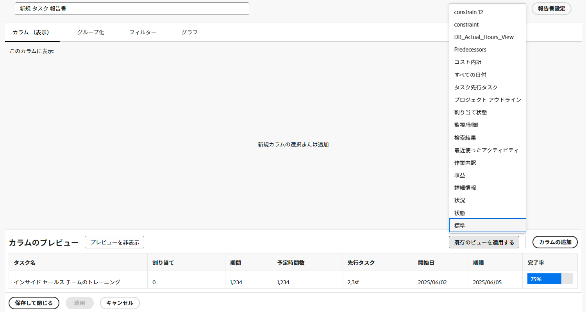

# シンプルなレポートの作成

このビデオでは、次の方法を学習します。

* 既存のフィルター、表示、グループ化を使用したシンプルなレポートの作成

>[!VIDEO](https://video.tv.adobe.com/v/335153/?quality=12)

## アクティビティ：シンプルなタスクレポートの作成

1 つのレポート内のすべてのアクティブなタスクを追跡する場合。 次の手順を使用して、「My Current Tasks」という名前のタスクレポートを作成します。

* 列（表示） =標準
* グループ化=プロジェクト
* フィルタ=現在のタスク
* 説明=タスクの所有者である現在のプロジェクトの不完全なタスク（プロジェクトごとにグループ化）。

## 回答

1. 次に移動： **[!UICONTROL メインメニュー]** を選択し、 **[!UICONTROL レポート]**.
1. 次をクリック： **[!UICONTROL 新しいレポート]** ドロップダウンメニューで「 」を選択します。 **[!UICONTROL タスクレポート]**.
1. In [!UICONTROL 列（表示）]、 **[!UICONTROL 既存のビューの適用]** メニューと選択 **[!UICONTROL 標準]**.

   

1. 内 **[!UICONTROL グループ化]** タブで、 **[!UICONTROL 既存のグループの適用]** メニューと選択 **[!UICONTROL プロジェクト]**.

   

1. 内 **[!UICONTROL フィルター]** タブで、 **[!UICONTROL 既存のフィルターの適用]** メニューから「現在のタスク」を選択します。

   

1. 開く **[!UICONTROL レポート設定]** レポートに「My Current Tasks」という名前を付けます。
1. 「説明」フィールドに、「タスクの所有者である現在のプロジェクトの未完了タスク（プロジェクト別にグループ化）」と入力します。

   

1. レポートを保存して閉じます。
