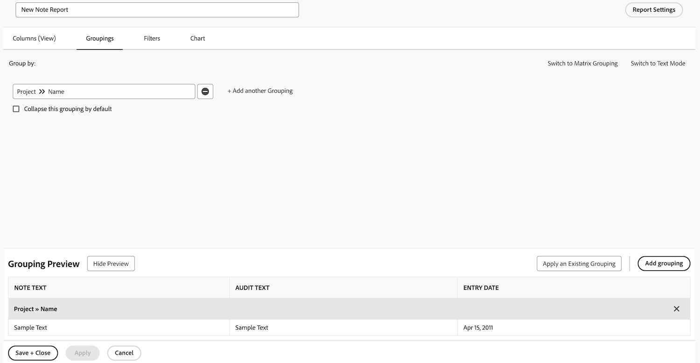

# タスクレポートの作成

このビデオでは、以下について説明します。

* 複雑なフィルターを使用したタスクレポートの作成方法
* 作成するレポートの見つけ方

>[!VIDEO](https://video.tv.adobe.com/v/335154/?quality=12&learn=on)

## アクティビティ：プロンプトを含む注記レポートを作成する

メモの内容、作成者、入口日、プロジェクト名、監査タイプに基づいて、ユーザーのメモ（コメントや更新など）やシステムのメモを検索するために使用できるメモレポートを作成します。 レポートに「Note Search」という名前を付けます。

「メモテキスト」プロンプトを使用すると、このレポートは更新スレッド内で検索し、プロンプトで指定された基準を満たすものをすばやく抽出します。 レポートを実行する際に、すべてのプロンプトに入力する必要はありません。必要なプロンプトはそれだけです。 空白の文字は自動的に無視されます。

ビューには、以下の列が含まれます。

* メモ テキスト
* 監査テキスト
* エントリ日
* 所有者：名前
* 監査の種類
* タスク名
* 問題名

「フィルター」タブは空白のままにします。

プロジェクト名のグループ。

次のプロンプトを表示します。

* 監査テキスト
* メモ テキスト
* 所有者名
* エントリ日
* プロジェクト名
* 監査の種類

## 回答

1. **[!UICONTROL メインメニュー]**&#x200B;から&#x200B;**[!UICONTROL レポート]**&#x200B;を選択します。
1. 次をクリック： **[!UICONTROL 新しいレポート]** メニューと選択 **[!UICONTROL 注意]**.
1. In **[!UICONTROL 列（表示）]** 列を設定して以下を含めます。

   

   * [!UICONTROL 注意] > [!UICONTROL メモテキスト]
   * [!UICONTROL 注意] > [!UICONTROL 監査テキスト]
   * [!UICONTROL 注意] > [!UICONTROL 入力日]
   * [!UICONTROL 所有者] > [!UICONTROL 名前]
   * [!UICONTROL 注意] > [!UICONTROL 監査タイプ]
   * [!UICONTROL タスク] > [!UICONTROL 名前]
   * [!UICONTROL 問題] > [!UICONTROL 名前]

1. を選択します。 **[!UICONTROL 入力日]** 列を編集し、 **[!UICONTROL 降順に並べ替え]**.
1. 内 **[!UICONTROL グループ化]** 」タブで、次の項目でグループ化するレポートを設定します。 [!UICONTROL プロジェクト] > [!UICONTROL 名前].

   

1. 終了 [!UICONTROL フィルター] 空白。
1. 開く **[!UICONTROL レポート設定]** レポートに「Note Search」という名前を付けます。
1. 内 [!UICONTROL 説明] フィールドに、「選択した監査タイプと他のプロンプトに基づいて、システムまたはユーザーのメモを検索します。 「監査テキスト」列にはシステムのメモが表示され、「ユーザーのメモ」は「メモテキスト」列に表示されます。」

   

1. 選択 **[!UICONTROL 「詳細」タブ]** レポートの読み込み時に表示されるようにします。
1. レポートがダッシュボードに含まれるときに 200 項目を表示するようにレポートを設定します。
1. クリック **[!UICONTROL レポートのプロンプト]** を追加します。

   

   * [!UICONTROL 注意] > [!UICONTROL 監査テキスト]
   * [!UICONTROL 注意] > [!UICONTROL メモテキスト]
   * [!UICONTROL 所有者] > [!UICONTROL 名前]
   * [!UICONTROL 注意] > [!UICONTROL 入力日]
   * [!UICONTROL プロジェクト] > [!UICONTROL 名前]
   * [!UICONTROL 注意] > [!UICONTROL 監査タイプ]

1. チェックボックスをオンにします。 **[!UICONTROL ダッシュボードにプロンプトを表示]**.
1. レポートを保存して閉じます。
