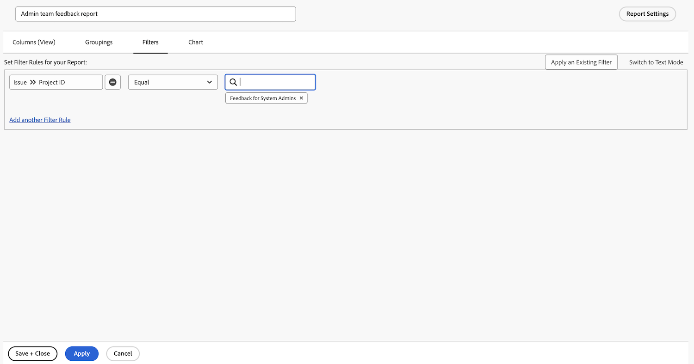

# タスクレポートの作成

ビデオでは、ログインしたユーザーに割り当てられた遅延タスクを追跡するカスタムレポートを作成する手順を段階的に説明します。最初に、既存のフィルター、ビュー、ビルトインレポートが特定の要件を満たしていない場合のカスタムレポートの必要性を説明します。レポートには「自分に割り当てられた遅延タスク」という名前が付けられ、わかりやすくするために説明が追加されています。

結果のレポートによって、ユーザーは遅延タスクに集中し、依存関係に関するインサイトを得て、ホストプロジェクトへのナビゲーションが簡素化できます。

>[!VIDEO](https://video.tv.adobe.com/v/3448343/?captions=jpn&quality=12&learn=on&enablevpops=0)

## 主な要点

* **カスタムレポートの作成：**&#x200B;既存のフィルターやビルトインレポートがニーズを満たさない場合は、カスタムレポートをゼロから作成して、ユーザーに割り当てられた遅延タスクなどの特定のデータに焦点を当てることができます。
* **フィルターの設定：**&#x200B;フィルターを使用して、遅延タスク、未完了タスク、現在のプロジェクト、ログインしているユーザーに割り当てられたタスクなどのレポート条件を定義します。
* **コンテキストの列：**&#x200B;依存関係の問題を特定するための「開始可能」列や、関連プロジェクトに簡単に移動できるハイパーリンクが含まれる「プロジェクト名」列などを追加します。
* **優先度による並べ替え：**&#x200B;期限からの経過時間が最も長いタスクをレポートの先頭に優先付けするために、「期限」列で昇順にタスクを並べ替えます。
* **アクセシビリティ：**&#x200B;レポートを保存、ピン留め、またはお気に入りにマークしてすばやくアクセスできるようにし、遅延タスクを効率的に追跡および管理します。

## 「タスクレポートの作成」アクティビティ

>[!TIP]
>
>スパチュラとミキシングボウルを取り出して、[Adobe Workfront Customer Reporting Cookbook](/help/assets/workfront-customer-reporting-cookbook.pdf) の「レシピ」を試す準備をしましょう。10 件のレポートに関する段階的な手順が記載されています。今すぐ環境に取り組むことができます。
>&#x200B;>お客様からのお気に入りのレポートを集め、軽食で消化しやすいクックブックにまとめました。持ち帰ってご自身の Workfront キッチンで試してみてください。
>&#x200B;>この 10 件のレポートは、お客様と同じような顧客からのものです。業界、部門、チーム、役職を超えて、様々な企業にまたがって、お気に入りのレポートを共有してくださった素晴らしいお客様に多大な感謝を申し上げます。レポートの中には、シンプル (ただし非常に便利) なものもあれば、レポートを次のレベルに引き上げるために複雑なものもあります。

### アクティビティ 1：プロンプト付きのメモレポートの作成

メモの内容、作成者、エントリ日、プロジェクト名、監査タイプに基づいて、ユーザーのメモ（コメントや更新など）またはシステムのメモを検索するために使用できるメモレポートを作成します。レポートに「メモ検索」という名前を付けます。

メモテキストプロンプトを使用すると、このレポートは更新スレッド内を検索して、プロンプトで指定した基準を満たすスレッドを素早く抽出します。レポートを実行する際は、すべてのプロンプトに入力する必要はなく、必要な情報だけを入力します。空白の情報は自動的に無視されます。

ビューには、次の列を含める必要があります。

* メモ テキスト
* 監査テキスト
* エントリ日
* 所有者：名前
* 監査の種類
* タスク名
* 問題名

フィルタータブは空白のままにします。

プロジェクト名でグループ化します。

次のプロンプトを含めます。

* 監査テキスト
* メモ テキスト
* 所有者名
* エントリ日
* プロジェクト名
* 監査の種類

### 回答 1

1. **[!UICONTROL メインメニュー]**&#x200B;から「**[!UICONTROL レポート]**」を選択します。
1. **[!UICONTROL 新しいレポート]**&#x200B;メニューをクリックし、「**[!UICONTROL メモ]**」を選択します。
1. **[!UICONTROL 列（表示）]**&#x200B;で、以下を含む列を設定します。

   

   * [!UICONTROL メモ]／[!UICONTROL メモテキスト]
   * [!UICONTROL メモ]／[!UICONTROL 監査テキスト]
   * [!UICONTROL メモ]／[!UICONTROL エントリ日]
   * [!UICONTROL 所有者]／[!UICONTROL 名前]
   * [!UICONTROL メモ]／[!UICONTROL 監査タイプ]
   * [!UICONTROL タスク]／[!UICONTROL 名前]
   * [!UICONTROL イシュー]／[!UICONTROL 名前]

1. **[!UICONTROL エントリ日]**&#x200B;列を選択し、**[!UICONTROL 降順に並べ替え]**&#x200B;に変更します。
1. 「**[!UICONTROL グループ化]**」タブで、レポートを[!UICONTROL プロジェクト]／[!UICONTROL 名前]でグループ化するように設定します。

   

1. [!UICONTROL フィルター]は空白のままにします。
1. **[!UICONTROL レポート設定]**&#x200B;を開き、レポートに「メモ検索」という名前を付けます。
1. 「[!UICONTROL 説明]」フィールドに、「選択した監査タイプとその他のプロンプトに基づいて、システムまたはユーザーのメモを検索します。システムのメモは監査テキスト列に表示され、ユーザーのメモはメモテキスト列に表示されます。」というような情報を入力します。

   

1. **[!UICONTROL 「詳細」タブ]**&#x200B;を選択し、レポートの読み込み時に表示されるようにします。
1. レポートがダッシュボードに含まれている場合、200 項目を表示するようにレポートを設定します。
1. 「**[!UICONTROL レポートプロンプト]**」をクリックし、以下を追加します。

   

   * [!UICONTROL メモ]／[!UICONTROL 監査テキスト]
   * [!UICONTROL メモ]／[!UICONTROL メモテキスト]
   * [!UICONTROL 所有者]／[!UICONTROL 名前]
   * [!UICONTROL メモ]／[!UICONTROL エントリ日]
   * [!UICONTROL プロジェクト]／[!UICONTROL 名前]
   * [!UICONTROL メモ]／[!UICONTROL 監査タイプ]

1. 「**[!UICONTROL ダッシュボードにプロンプトを表示]**」チェックボックスをオンにします。
1. レポートを保存して閉じます。

### アクティビティ 2：管理チームのフィードバックレポートの作成

これは、システム管理者向けに作成されたフィードバックリクエストキューからのすべての問題を表示する問題のレポートです。このリクエストキューの作成方法については、[システム管理者のフィードバックリクエストキューの作成](https://experienceleague.adobe.com/docs/workfront-learn/tutorials-workfront/manage-work/request-queues/create-a-system-admin-feedback-request-queue.html?lang=ja)チュートリアルを参照してください。

また、このレポートは、カスタムフォームも使用します。カスタムフォームの作成方法については、[カスタムフォームの作成と共有](https://experienceleague.adobe.com/docs/workfront-learn/tutorials-workfront/custom-data/custom-forms/custom-forms-creating-and-sharing-a-custom-form.html?lang=ja)チュートリアルを参照してください。

このカスタムフォームでは、プロジェクトタイプとイシューオブジェクトタイプを使用し、次のように作成する必要があります。

名前：管理プロセスのフィードバック

1. プロセスのタイプ（単一選択ドロップダウンフィールド）
   * アクセスレベル
   * 承認プロセス（グローバルのみ）
   * メール通知
   * レイアウトテンプレート
   * マイルストーンパス
   * プロジェクトテンプレート
   * リマインダー通知
   * リクエストキュー
1. プロセス名（1 行のテキストフィールド）
1. プロセスのグレード（単一選択ドロップダウンフィールド）
   * 1 - 完全に役に立たない
   * 2 - あまり役に立たない
   * 3 - 良い。ただし改善の余地はある
   * 4 - 優良
1. 問題または良いニュース（段落テキストフィールド）

**管理チームのフィードバックレポート**&#x200B;という名前の問題のレポートを作成します。

ビューには次の列が必要です。

* イシュー：名前
* プライマリ連絡先：名前
* イシュー：プロセスタイプ
* イシュー：プロセス名
* イシュー：プロセスグレード
* イシュー：イシューまたは良いニュース
* イシュー：エントリ日
* イシュー：経過期間
* イシュー：割り当て
* イシュー：ステータス

プロセスタイプでグループ化します。

フィードバックの問題が存在するリクエストキュープロジェクトの ID でフィルタリングします。

### 回答 2

1. **[!UICONTROL メインメニュー]**&#x200B;から&#x200B;**[!UICONTROL レポート]**&#x200B;を選択します。
1. **[!UICONTROL 新規レポート]**&#x200B;メニューをクリックし、「**[!UICONTROL イシュー]**」を選択します。
1. **[!UICONTROL 列（表示）]**&#x200B;で、以下を含む列を設定します。

   

   * [!UICONTROL イシュー]／[!UICONTROL 名前]
   * [!UICONTROL プライマリ連絡先]／[!UICONTROL 名前]
      * メモ：これは、列のラベルとして「所有者:Name」と表示されます。これを「報告者」に変更するには、「詳細オプション」をクリックし、「**カスタム列ラベル**」フィールドに「報告者」と入力します。
   * [!UICONTROL イシュー]／[!UICONTROL プロセスタイプ]
   * [!UICONTROL イシュー]／[!UICONTROL プロセス名]
   * [!UICONTROL イシュー]／[!UICONTROL プロセスグレード]
   * [!UICONTROL イシュー]／[!UICONTROL 問題または良いニュース]
   * [!UICONTROL イシュー]／[!UICONTROL エントリ日]
   * [!UICONTROL イシュー]／[!UICONTROL 経過期間]
   * [!UICONTROL イシュー]／[!UICONTROL 割り当て]
   * [!UICONTROL イシュー]／[!UICONTROL ステータス]

1. **[!UICONTROL エントリ日]**&#x200B;列を選択し、**[!UICONTROL 降順に並べ替え]**&#x200B;に変更します。
1. 「**[!UICONTROL グループ化]**」タブで、レポートを&#x200B;**[!UICONTROL イシュー]／[!UICONTROL プロセスタイプ]**&#x200B;ごとにグループ化するように設定します。

   

1. 「**[!UICONTROL フィルター]**」タブで、フィードバックの問題が存在するリクエストキュープロジェクトと一致するように、**[!UICONTROL 問題]／[!UICONTROL プロジェクト ID]** のフィルターを追加します。

   

1. レポートを保存して閉じます。
