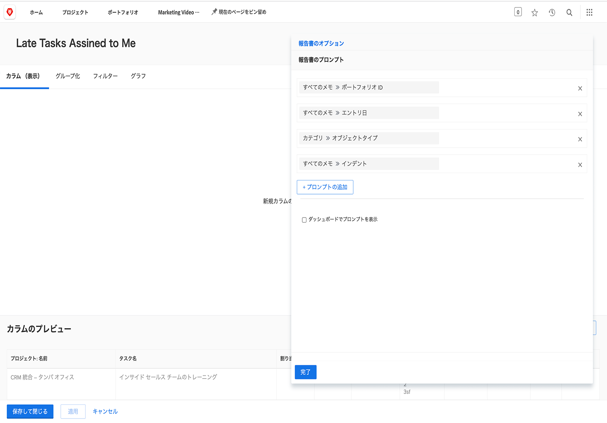
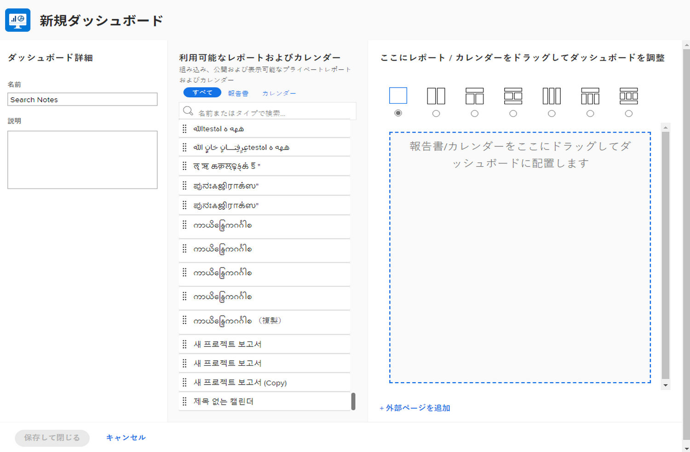
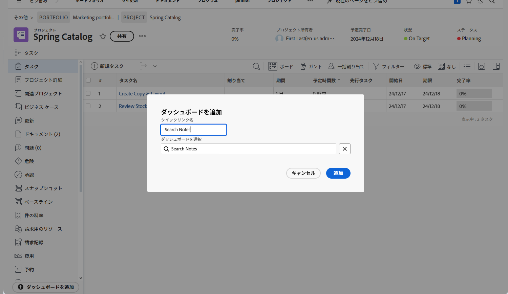
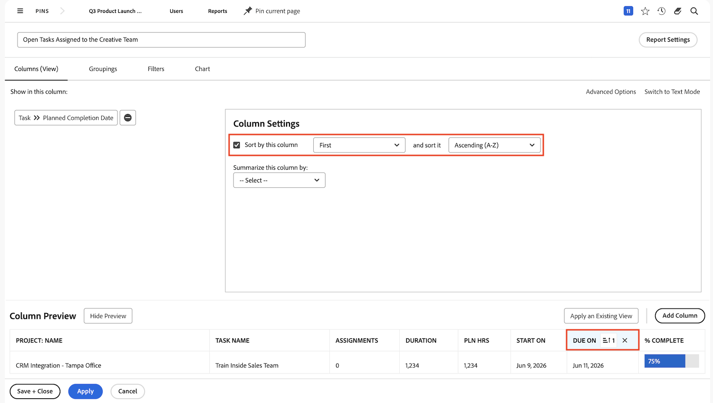
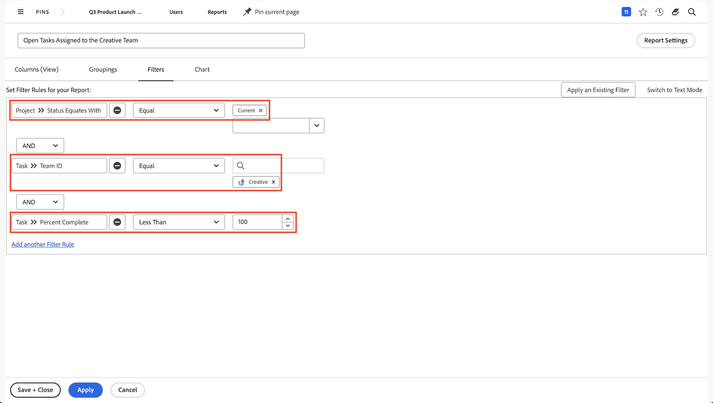
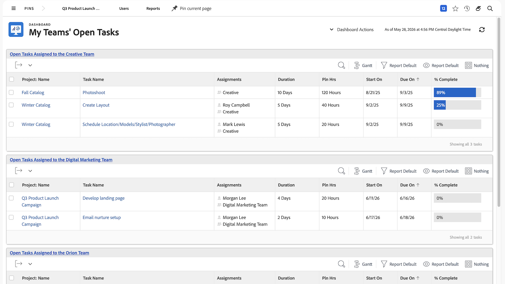

# Workfrontでのダッシュボードの作成

このビデオでは、Workfrontのダッシュボードについて理解し、使用するための包括的なガイドを提供します。
&#x200B;ダッシュボードとは、ユーザーが関連データを整理して一元的に表示できるレポートの集まりのことです。

>[!VIDEO](https://video.tv.adobe.com/v/335157/?quality=12&learn=on&enablevpops=0)

## 主な要点

* **Workfront のダッシュボード：**&#x200B;ダッシュボードは、ユーザーがプロジェクト、タスク、イシューなどの関連データを 1 つの一元化されたビューに整理して表示できるレポートのコレクションです。
* **ダッシュボードの作成：** ダッシュボードは、レイアウトを選択し、レポート、カスタムカレンダー、外部ページを追加して、最適な表示に配置することでカスタマイズできます。&#x200B; ユーザーは、ダッシュボード内でどの列を並べてレポートに表示するかをカスタマイズすることもでき&#x200B;す。
* **ダッシュボードへのアクセス：** ダッシュボードは、ダッシュボード領域の「マイダッシュボード」、「共有ダッシュボード」、または「すべてのダッシュボード」の下にあります。&#x200B;頻繁に使用するダッシュボードは、ピン留めしたり、お気に入りに追加したりして、すばやくアクセスでき&#x200B;す。
* **ダッシュボードの共有：**&#x200B;ダッシュボードは、「ダッシュボードアクション」メニューを通じて、ダッシュボード内のすべてのレポートを含めて、他の Workfront ユーザーと共有できます。
* **ダッシュボードの印刷：**&#x200B;ダッシュボードは、「ダッシュボードアクション」メニューから直接印刷できるので、データの物理的なコピーを簡単に共有できます。

## 「ダッシュボードの作成」アクティビティ

### アクティビティ 1：ダッシュボードの作成

[!UICONTROL ダッシュボード]に、「このプロジェクトのメモを検索」という 1 つのレポートのみを作成します。 これは、検索する更新が何千もある場合でも、プロジェクトで行われた更新を素早く見つけるのに役立ちます。 これにより、更新スレッドを検索して、プロンプトで指定した基準を満たす更新を素早く抽出します。

「メモレポートを作成」アクティビティで作成した「メモを検索」レポートのコピーを作成して、このレポートを作成します。 まだ作成していませんか？ タスクレポートの作成チュートリアルのアクティビティを表示するには、[こちら](https://experienceleague.adobe.com/ja/docs/workfront-learn/tutorials-workfront/reporting/basic-reporting/create-a-task-report#activity-1-create-a-note-report-with-prompts)をクリックしてください。

* コピーから「プロジェクト名」プロンプトを削除し、レポートの名前を「このプロジェクトのメモを検索」に変更します。
* [!UICONTROL ダッシュボード]に「メモを検索」という名前を付けます。
* 任意のプロジェクトランディングページに移動し、[!UICONTROL ダッシュボード]のカスタムセクションを作成します。
* カスタムセクションでメモを検索すると、現在参照しているプロジェクト内に含まれるメモのみが表示されます。

### 回答 1

1. 「メモレポートを作成」アクティビティで作成したレポートを実行します。 まだ作成していませんか？ タスクレポートの作成チュートリアルのアクティビティを表示するには、[こちら](https://experienceleague.adobe.com/ja/docs/workfront-learn/tutorials-workfront/reporting/basic-reporting/create-a-task-report#activity-1-create-a-note-report-with-prompts)をクリックしてください。
1. 「**[!UICONTROL レポートアクション]**」をクリックし、「**[!UICONTROL コピー]**」を選択します。 [!DNL Workfront] で「メモ検索（コピー）」という名前の新しいレポートが作成されます。
1. **[!UICONTROL レポートアクション]**&#x200B;に移動し、「**[!UICONTROL 編集]**」を選択します。 「**[!UICONTROL レポート設定]**」をクリックし、名前を「このプロジェクトのメモを検索」に変更します。
1. 「[!UICONTROL レポートプロンプト]」をクリックし、[!UICONTROL プロジェクト]／[!UICONTROL 名前]のリストからプロンプトを削除します。

   

1. 「**[!UICONTROL ダッシュボードにプロンプトを表示]**」ボックスのチェックをオンにします。
1. 「**[!UICONTROL 完了]**」をクリックし、「**[!UICONTROL 保存して閉じる]**」を選択します。 これで、レポートの[!UICONTROL プロンプト]画面が表示されます。

   次に、ショートカットを使用して新しいダッシュボードを作成し、そのダッシュボードにこのレポートを追加します。

1. 「**[!UICONTROL レポートアクション]**」をクリックし、**[!UICONTROL クラシックダッシュボードに追加]**／**[!UICONTROL 新しいダッシュボード]**&#x200B;を選択します。
1. レポート「このプロジェクトのメモを検索」を&#x200B;**[!UICONTROL レイアウト]**&#x200B;パネルにドラッグします。
1. レポートの名前がダッシュボードの名前になります。 名前を編集して単に「メモを検索」にします。

   

1. 「**[!UICONTROL 保存して閉じる]**」をクリックします。

   次に、ダッシュボードをプロジェクトページに追加します。

   

1. 任意のプロジェクトに移動します。 左のパネルメニューから、「**[!UICONTROL ダッシュボードを追加]**」ボタンをクリックします。
1. 「**[!UICONTROL ダッシュボードを選択]**」フィールドに「メモを検索」と入力し、リストから「[!UICONTROL ダッシュボード]」を選択します。
1. 「**[!UICONTROL クイックリンクの名前]**」フィールドに「メモを検索」と入力します。
1. 「**[!UICONTROL 追加]**」をクリックします。
1. 左のパネルメニューから、下部近くにある「メモを検索」を見つけます。 名前の左にあるドットをクリックし、「更新」の真下までドラッグします。

### アクティビティ 2：チームのオープンタスク

タスクに割り当てられた異なるチームによってフィルタリングされた3つの「開いているタスク」レポートを含む[!UICONTROL  ダッシュボード ]を作成します。

チーム別にフィルタリングされた既存の「オープンタスク」レポートがある場合は、それを使用するか、このダッシュボード用に新しいレポートを作成します。 2つの追加のチームに対してレポートを2回コピーして編集し、**「マイチームのオープンタスク」**&#x200B;という名前の単一のダッシュボードに配置します。

### 回答 2

#### パート 1 - チームの1つでフィルタリングされた「開いているタスク」レポートを作成する

1. **[!UICONTROL メインメニュー]**&#x200B;から「**[!UICONTROL レポート]**」を選択します。
1. **[!UICONTROL 新規レポート]** メニューをクリックし、**[!UICONTROL タスク]**&#x200B;を選択します。
1. レポートに「Creative チームに割り当てられたオープンタスク」（または他のチーム）という名前を付けます。
1. **[!UICONTROL 列（表示）]**&#x200B;で、以下を含む列を設定します。

   

   * [!UICONTROL プロジェクト]／[!UICONTROL 名前]
   * [!UICONTROL タスク]／[!UICONTROL 名前]
   * [!UICONTROL  タスク ] > [!UICONTROL 割り当て]
   * [!UICONTROL  タスク ] > [!UICONTROL 期間]
   * [!UICONTROL  タスク ] > [!UICONTROL 予定時間数]
   * [!UICONTROL  タスク ] > [!UICONTROL 予定開始日]
   * [!UICONTROL  タスク ] > [!UICONTROL 予定完了日]
   * [!UICONTROL  タスク ] > [!UICONTROL 完了率]

1. **[!UICONTROL 完了予定日]**&#x200B;列を選択し、並べ替えを&#x200B;**昇順**&#x200B;に変更します。

1. 「**[!UICONTROL フィルター]**」タブで、フィルタールールを追加して次を含めます。

   

   * [!UICONTROL  プロジェクト ] > [!UICONTROL 状態が] > [!UICONTROL 次と等しい] > &quot;現在&quot;
   * [!UICONTROL Task] > [!UICONTROL Team ID] > [!UICONTROL Equal] > &quot;Creative&quot;
   * [!UICONTROL  タスク ] > [!UICONTROL 完了率] > [!UICONTROL 未満] > &quot;100&quot;

1. 「**[!UICONTROL 保存+閉じる]**」ボタンをクリックして、レポートを保存して閉じます。

#### パート 2 – 作成したレポートをコピーし、2番目のチーム用に新しいレポートを作成します

1. 作成したレポートを表示するには、**[!UICONTROL Report Actions]/[!UICONTROL Copy]**&#x200B;をクリックします。
1. 新しいレポートが表示され、タイトルに「**」（コピー）「**」という名前が追加されます。
1. 「**[!UICONTROL アクションを報告] > [!UICONTROL 編集]**」をクリックします。 次に、フィルターとレポートタイトルを変更して、Orion チーム（または他のチーム）に焦点を当てます。
1. 「[!UICONTROL  フィルター]」タブをクリックし、フィルタールールを変更します
   **[!UICONTROL Task] > [!UICONTROL Team ID] > [!UICONTROL Equal] > &quot;Creative&quot;**から
   **[!UICONTROL タスク ] > [!UICONTROL  チーム ID] > [!UICONTROL 次と等しい] > &quot;Orion&quot;**
1. 「レポートのタイトル」フィールドで、「**[!UICONTROL &quot;Creative&quot;]**」という単語を「**[!UICONTROL &quot;Orion&quot;]**」に変更し、「**&quot;（コピー）&quot;**」という単語を削除します。
1. 「**[!UICONTROL 保存+閉じる]**」ボタンをクリックして、レポートを保存して閉じます。

#### パート 3 - レポートをもう一度コピーして、3つ目のチーム用に新しいレポートを作成する

1. 作成したレポートを表示するには、「**[!UICONTROL Report Actions]」 > 「[!UICONTROL Copy]**」をもう一度クリックします。 今回は、タイトルのチーム名とフィルターを「デジタルマーケティング」（または他のチーム）に変更します。

#### パート 4 – 各チームの開いているタスクを表示するダッシュボードを作成する

1. メインメニューから、**[!UICONTROL ダッシュボード]**&#x200B;をクリックします。
1. 次に、**[!UICONTROL 新規ダッシュボード]**&#x200B;をクリックします。

   

1. ダッシュボードに&#x200B;**「チームの開いているタスク」**&#x200B;という名前を付けます。
1. 「**[!UICONTROL 名前で検索]**」フィールドにレポートの名前を入力します。
1. レポート名はすべて同じ単語で始まるので、次のように表示される場合があります。

   

1. 各レイヤーをレイアウト領域にドラッグし、「保存」をクリックして閉じます。

   

1. これが最後のダッシュボードです。

   
