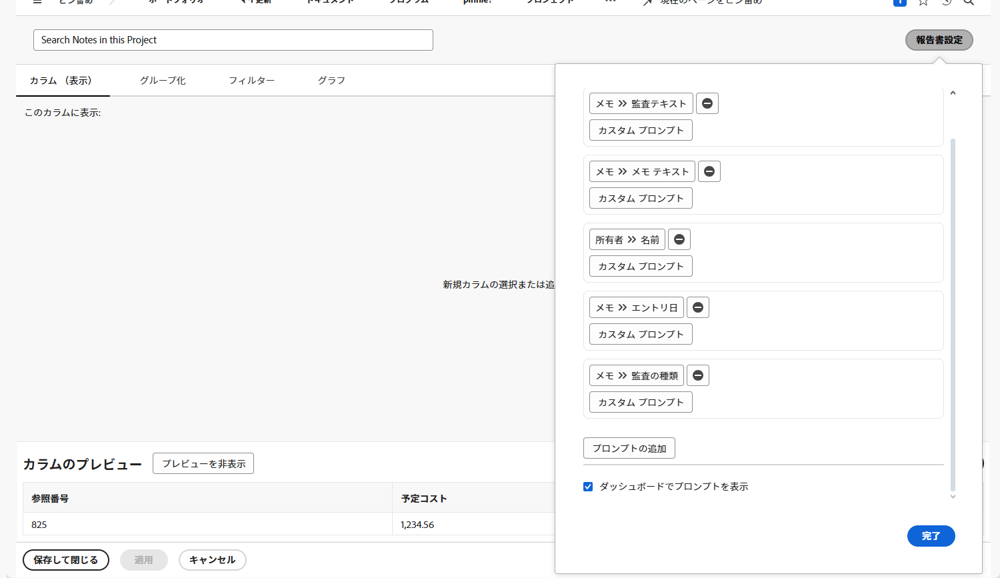

# ダッシュボードの作成

ビデオでは、Workfront のダッシュボードについて、および使用方法について包括的に説明します。
ここでは、ダッシュボードとは、ユーザーが関連データを 1 か所に整理して表示できるレポートのコレクションであると説明しています。

>[!VIDEO](https://video.tv.adobe.com/v/335157/?quality=12&learn=on)

## 主な要点

* **Workfront のダッシュボード：**&#x200B;ダッシュボードは、ユーザーがプロジェクト、タスク、イシューなどの関連データを 1 つの一元化されたビューに整理して表示できるレポートのコレクションです。
* **ダッシュボードの作成：**&#x200B;ダッシュボードは、レイアウトを選択し、レポート、カスタムカレンダー、外部ページを追加し、最適な表示になるように配置してカスタマイズできます。また、ユーザーは、ダッシュボード内の並列レポートに表示される列をカスタマイズすることもできます。
* **ダッシュボードへのアクセス：**&#x200B;ダッシュボードは、ダッシュボードエリアの「マイダッシュボード」、「共有ダッシュボード」、「すべてのダッシュボード」で見つけることができます。頻繁に使用するダッシュボードは、すぐにアクセスできるように、ピン留めしたり、お気に入りに追加したりできます。
* **ダッシュボードの共有：**&#x200B;ダッシュボードは、「ダッシュボードアクション」メニューを通じて、ダッシュボード内のすべてのレポートを含めて、他の Workfront ユーザーと共有できます。
* **ダッシュボードの印刷：**&#x200B;ダッシュボードは、「ダッシュボードアクション」メニューから直接印刷できるので、データの物理的なコピーを簡単に共有できます。

## 「ダッシュボードの作成」アクティビティ

### アクティビティ 1：ダッシュボードの作成

[!UICONTROL ダッシュボード]に、「このプロジェクトのメモを検索」という 1 つのレポートのみを作成します。これは、検索する更新が何千もある場合でも、プロジェクトで行われた更新を素早く見つけるのに役立ちます。これにより、更新スレッドを検索して、プロンプトで指定した基準を満たす更新を素早く抽出します。

「メモレポートを作成」アクティビティで作成した「メモを検索」レポートのコピーを作成して、このレポートを作成します。 まだ作成していませんか？タスクレポートの作成チュートリアルのアクティビティを表示するには、[こちら](https://experienceleague.adobe.com/ja/docs/workfront-learn/tutorials-workfront/reporting/basic-reporting/create-a-task-report#activity-1-create-a-note-report-with-prompts)をクリックしてください。

* コピーから「プロジェクト名」プロンプトを削除し、レポートの名前を「このプロジェクトのメモを検索」に変更します。
* [!UICONTROL ダッシュボード]に「メモを検索」という名前を付けます。
* 任意のプロジェクトランディングページに移動し、[!UICONTROL ダッシュボード]のカスタムセクションを作成します。
* カスタムセクションでメモを検索すると、現在参照しているプロジェクト内に含まれるメモのみが表示されます。

### 回答 1

1. 「メモレポートを作成」アクティビティで作成したレポートを実行します。まだ作成していませんか？タスクレポートの作成チュートリアルのアクティビティを表示するには、[こちら](https://experienceleague.adobe.com/ja/docs/workfront-learn/tutorials-workfront/reporting/basic-reporting/create-a-task-report#activity-1-create-a-note-report-with-prompts)をクリックしてください。
1. 「**[!UICONTROL レポートアクション]**」をクリックし、「**[!UICONTROL コピー]**」を選択します。[!DNL Workfront] で「メモ検索（コピー）」という名前の新しいレポートが作成されます。
1. **[!UICONTROL レポートアクション]**&#x200B;に移動し、「**[!UICONTROL 編集]**」を選択します。「**[!UICONTROL レポート設定]**」をクリックし、名前を「このプロジェクトのメモを検索」に変更します。
1. 「[!UICONTROL レポートプロンプト]」をクリックし、[!UICONTROL プロジェクト]／[!UICONTROL 名前]のリストからプロンプトを削除します。

   

1. 「**[!UICONTROL ダッシュボードにプロンプトを表示]**」ボックスのチェックをオンにします。
1. 「**[!UICONTROL 完了]**」をクリックし、「**[!UICONTROL 保存して閉じる]**」を選択します。これで、レポートの[!UICONTROL プロンプト]画面が表示されます。

   次に、ショートカットを使用して新しいダッシュボードを作成し、そのダッシュボードにこのレポートを追加します。

1. **[!UICONTROL レポートアクション]** をクリックし、**[!UICONTROL クラシックダッシュボードに追加]**/**[!UICONTROL 新しいダッシュボード]** を選択します。
1. レポート「このプロジェクトのメモを検索」を&#x200B;**[!UICONTROL レイアウト]**&#x200B;パネルにドラッグします。
1. レポートの名前がダッシュボードの名前になります。名前を編集して単に「メモを検索」にします。

   

1. 「**[!UICONTROL 保存して閉じる]**」をクリックします。

   次に、ダッシュボードをプロジェクトページに追加します。

   

1. 任意のプロジェクトに移動します。左側のパネルメニューから、「**[!UICONTROL ダッシュボードを追加]**」ボタンをクリックします。
1. **[!UICONTROL ダッシュボードを選択]** フィールドに「メモを検索」と入力し、リストから [!UICONTROL  ダッシュボード ] を選択します。
1. **[!UICONTROL クイックリンク名]** フィールドに「メモを検索」と入力します。
1. 「**[!UICONTROL 追加]**」をクリックします。
1. 左のパネルメニューで、下部にあるメモを検索を見つけます。 名前の左側にあるドットをクリックし、「更新」の下にドラッグします。
