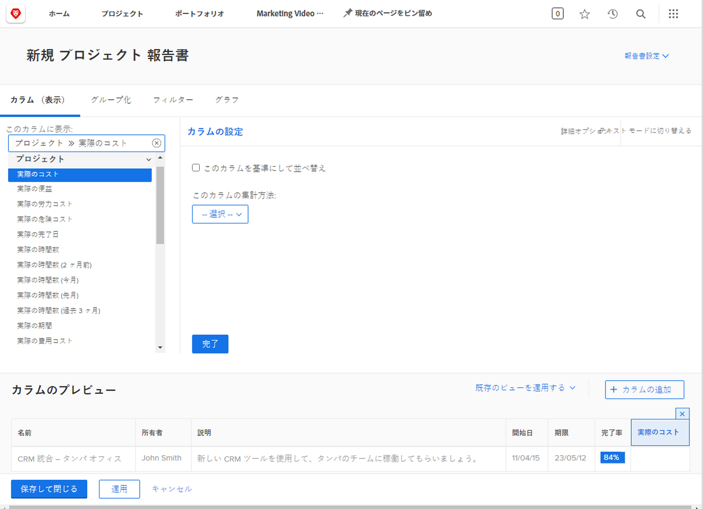
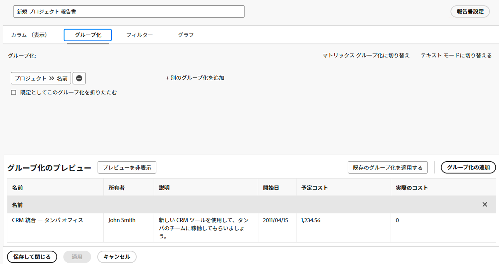
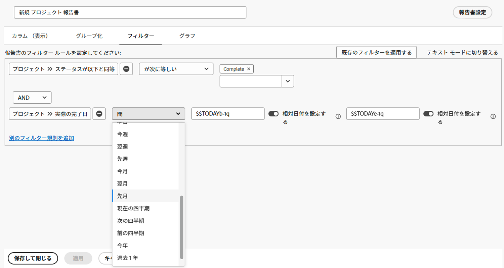
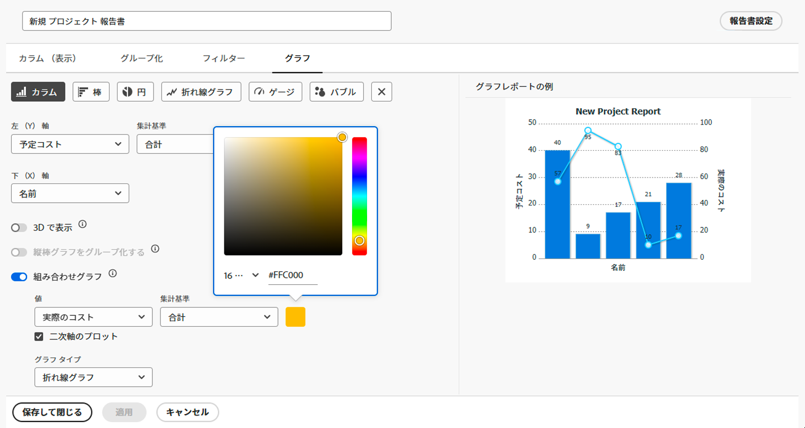

# レポートのチャートでデータを可視化

この動画では、特にプロジェクトタスクのトラッキングで、チャートを使用してデータを効果的に可視化する方法を説明します。 &#x200B; Workfrontで2種類のレポートを作成する方法を示しています。

**プロジェクト別遅延タスクレポート：**

* リストレポートから始め、フィルターを適用して、現在のプロジェクトで不完全で後期のタスクのみを表示します。 &#x200B;
* プロジェクト名でタスクをグループ化し、円グラフを作成して、プロジェクト間の遅延タスクの分布を視覚化します。 &#x200B;
* 簡単にアクセスできるデフォルトのタブとしてグラフを設定します。 &#x200B;

**プロジェクト別タスクおよび進捗ステータスレポート：**

* 最初のレポートをコピーし、タスクの進捗ステータスに関する別のグループを追加します。
* フィルターを削除してすべてのタスクを含め、プロジェクト実行中の進捗を表示します。
* 積み重ね縦棒グラフを使用して、プロジェクト別のタスクの合計数を表示します。積み重ねは様々な進捗ステータスを表します。
* 必要に応じてカラーをカスタマイズし、レポートを保存します。

この動画では、円グラフや積み重ね棒グラフなどのチャートを通じて、タスクの分布とプロジェクトのパフォーマンスに関するインサイトを獲得する方法を解説します。この機能により、ユーザーはプロジェクトを比較し、タスクの進捗状況を視覚的に把握できます。 &#x200B;

>[!VIDEO](https://video.tv.adobe.com/v/3450015/?captions=jpn&quality=12&learn=on&enablevpops=0)

## 重要な留意点

* **グラフ データの明瞭性を強化**: データを円グラフや棒グラフなどのグラフで視覚化すると、リストレポートと比較して、タスクの分布とプロジェクトの進捗状況を簡単に把握できます。 &#x200B;
* **特定のインサイトのフィルタリング**: フィルター（現在のプロジェクトで不完全で遅延したタスクなど）を適用すると、ターゲット分析に関連するデータに集中できます。 &#x200B;
* **より優れた組織のためのグループ化**: プロジェクト名または進捗状況でタスクをグループ化すると、データが効果的に整理され、プロジェクト間で有意義な比較が可能になります。 &#x200B;
* **グラフのカスタマイズ オプション**：ユーザーはグラフの種類（円、列、棒など）を選択し、好みやブランディングに合わせて色をカスタマイズできます。 &#x200B;
* **詳細インサイト用の積み重ね縦棒グラフ**：積み重ね縦棒グラフでは、プロジェクト内のタスクの進捗を包括的に表示し、合計タスク数とそのステータスの両方を 1 つのビジュアライゼーションで表示します。

## 「グラフを使用したレポートの作成」アクティビティ

### アクティビティ 1：レポートへのグラフの追加

四半期の終わりが近づいており、最近完了したプロジェクトがどの程度予算内に収まっているかを確認します。 プロジェクトの予定コストと実績コストを示すレポートを作成します。 前四半期に完了したプロジェクトのみを表示します。 カスタムのカラーを使用して、組み合わせの縦棒グラフを追加します。

### 回答 1

1. **[!UICONTROL メインメニュー]**&#x200B;から「**[!UICONTROL レポート]**」を選択します。
1. **[!UICONTROL 新しいレポート]**&#x200B;メニューをクリックし、「**[!UICONTROL プロジェクト]**」を選択します。
1. 「**[!UICONTROL 列（表示）]**」タブで、「**[!UICONTROL 列を追加]**」をクリックします。
1. [!UICONTROL プロジェクト]／[!UICONTROL 予定コスト]を選択し、この列を&#x200B;**[!UICONTROL 合計]**&#x200B;で集計します。
1. 「**[!UICONTROL 列を追加]**」を再度クリックします。
1. [!UICONTROL プロジェクト]／[!UICONTROL 実績コスト]を選択し、この列を&#x200B;**[!UICONTROL 合計]**&#x200B;で集計します。

   

1. 「**[!UICONTROL グループ化]**」タブで[!UICONTROL プロジェクト]／[!UICONTROL 名前]を選択し、レポートをグループ化するように設定します。

   

1. 「**[!UICONTROL フィルター]**」タブで、次の 2 つのフィルタールールを追加します。

   * [!UICONTROL プロジェクト]／[!UICONTROL ステータスが次と等しい]／[!UICONTROL 完了]
   * [!UICONTROL プロジェクト]／[!UICONTROL 実際の完了日]／[!UICONTROL 前四半期]

   

1. 「**[!UICONTROL グラフ]**」タブで、グラフタイプとして「**[!UICONTROL 列]**」を選択します。
1. [!UICONTROL 左（Y）軸]については、「[!UICONTROL 予定コスト]」を選択します。
1. [!UICONTROL 下（X）軸]については、「[!UICONTROL 名前]」を選択します。
1. 「**[!UICONTROL 組み合わせグラフ]**」ボタンをクリックし、「**[!UICONTROL 値]**」フィールドで「[!UICONTROL 実際のコスト]」を選択します。
1. 「**[!UICONTROL グラフタイプ]**」フィールドで「折れ線グラフ」を選択します。
1. カラーボックスをクリックし、[!UICONTROL 実際のコスト]のカラーを変更します。 カラーを選択します。
1. 「**[!UICONTROL 保存して閉じる]**」をクリックします。 レポート名の入力を求められたら、「前四半期に完了したプロジェクトごとの予定コストと実際のコスト」と入力します。

   
