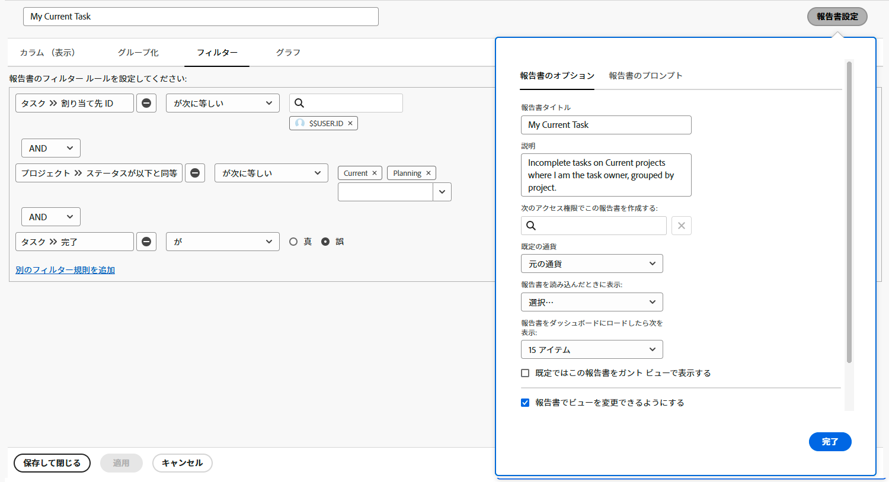

# シンプルなレポートアクティビティの作成

ステップごとの手順を使用して、簡単なレポートを作成する練習を行います。

## アクティビティ 1：シンプルなタスクレポートの作成

1 つのレポート内のすべてのアクティブなタスクを追跡したいと考えています。次の手順を使用して、「現在のマイタスク」という名前のタスクレポートを作成します。

* 列（表示）= 標準
* グループ化 = プロジェクト
* フィルター = 現在の自分のタスク
* 説明 = 自分がタスク責任者である、現在のプロジェクトの未完了タスク（プロジェクト別にグループ化）。

## 回答 1

1. **[!UICONTROL メインメニュー]**&#x200B;に移動し、「**[!UICONTROL レポート]**」を選択します。
1. 「**[!UICONTROL 新しいレポート]**」ドロップダウンメニューをクリックし、「**[!UICONTROL タスクレポート]**」を選択します。
1. [!UICONTROL 列（表示）]で「**[!UICONTROL 既存のビューを適用]**」メニューをクリックし、「**[!UICONTROL 標準]**」を選択します。

   

1. 「**[!UICONTROL グループ化]**」タブで「**[!UICONTROL 既存のグループ化を適用]**」メニューをクリックし、「**[!UICONTROL プロジェクト]**」を選択します。

   

1. 「**[!UICONTROL フィルター]**」タブで「**[!UICONTROL 既存のフィルターを適用]**」メニューをクリックし、「現在の自分のタスク」を選択します。

   

1. **[!UICONTROL レポート設定]** を開き、レポートに「現在のマイタスク」という名前を付けます。
1. 「説明」フィールドに「未完了」と入力します
自分がタスクである、現在のプロジェクトのタスク
所有者（プロジェクト別にグループ化）。」

   

1. レポートを保存して閉じます。
