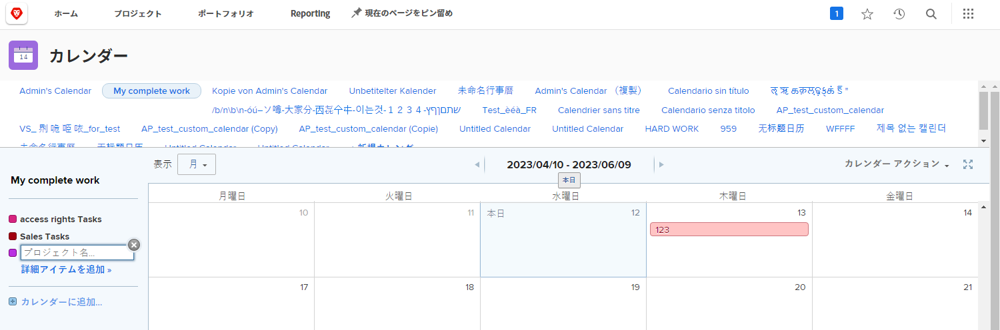
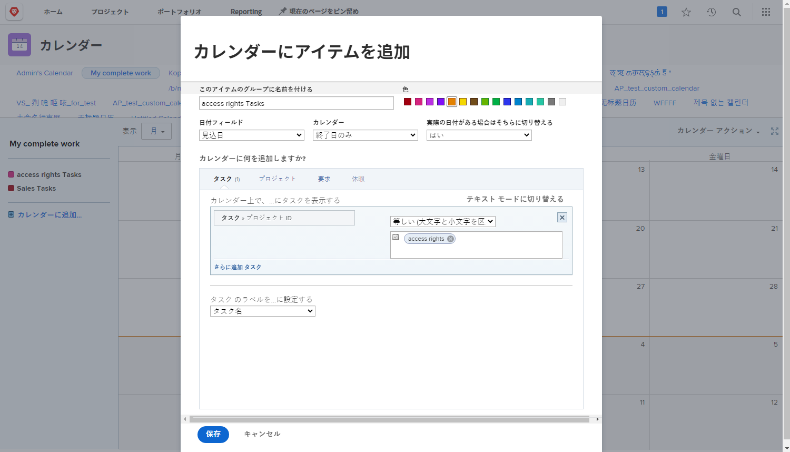
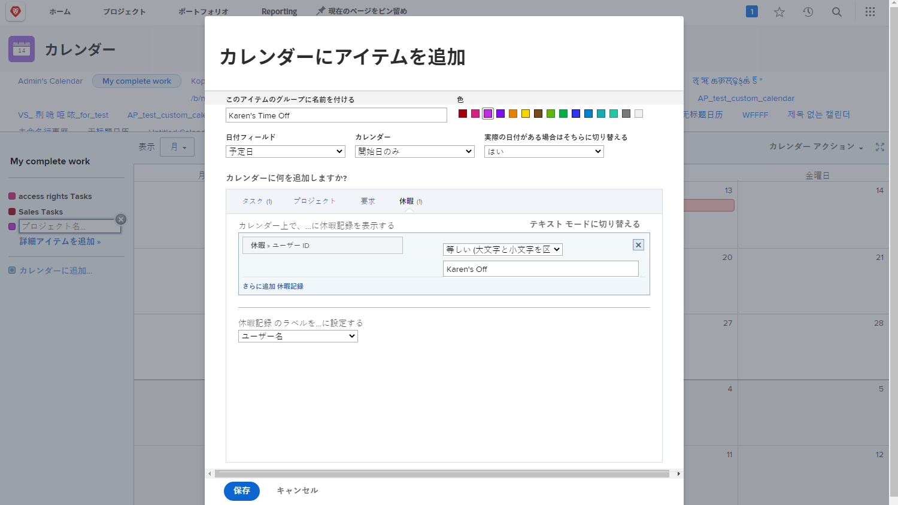

# カスタムカレンダーの作成

この節では、以下の方法について説明します。

* 新しいカレンダーを作成
* カレンダーグループの作成
* カレンダーグループに作業項目を追加
* カレンダーの休日を作成

次に、独自のカスタムカレンダーの作成方法を示します。

## 最初に、新しいカレンダーを追加します

1. 次の **[!UICONTROL メインメニュー]**&#x200B;を選択し、 **[!UICONTROL カレンダー]** 領域
1. 次をクリック： **[!UICONTROL 新しいカレンダー]** オプション。
1. カレンダーの名前を入力し、 **[!UICONTROL 戻る]**.

## 次に、カレンダーグループを追加します。

1. 特定のプロジェクトに関連する項目を表示するには、 [!UICONTROL グループ化] フィールド（このフィールドには、そのプロジェクトに関連するすべてのタスクが表示されます）
1. または、 **[!UICONTROL 詳細項目の追加]** システム内の様々なプロジェクトの作業項目を含めるオプション。

## 3 つ目は、カレンダーのグループ化に作業項目を追加する方法です

1. 表示内容を反映するようにグループに名前を付けます。
1. グループの色を選択します。
1. 使用する日付タイプを選択 —[!UICONTROL 推定日], [!UICONTROL 計画日]または [!UICONTROL カスタム]. ([!UICONTROL カスタム] 日付：次の日付フィールドが含まれます： [!UICONTROL カスタムフォーム].)
1. カレンダーに表示する日付を選択します —[!UICONTROL 終了日のみ], [!UICONTROL 開始日のみ]または [!UICONTROL 期間（開始から終了）].
1. 表示する [!UICONTROL 実際の日付] その情報が表示されたら、メニューから「はい」を選択します。 常に選択した日付タイプが必要な場合は、「いいえ」([!UICONTROL 推定], [!UICONTROL 計画済み]または [!UICONTROL カスタム]) をクリックして表示します。
1. カレンダーに表示する項目情報の種類を選択します —[!UICONTROL タスク], [!UICONTROL プロジェクト], [!UICONTROL 問題]または [!UICONTROL オフの時間].
1. 必要な情報を表示するフィルターを設定します。
1. 「**[!UICONTROL 保存]**」をクリックします。

>[!NOTE]
>
>「カレンダーに追加」オプションを使用して、追加のグループを既存のカレンダーに追加できます。

## 個人の休日を示すカレンダーを作成

[!DNL Workfront] は、ユーザープロファイルの個人のタイムオフ機能でのオフ時間を指定する方法を提供します。 この警告は、使用できないプロジェクトマネージャに対して警告を与え、必要に応じて、計画完了日を自動的または手動で調整することを許可します。

[ カレンダー ] 領域で、これらのタイムオフエントリを表示するカレンダービューを作成できます。

特定の個人のカレンダを作成する手順は、次のとおりです。

1. クリック **[!UICONTROL カレンダーに追加]** をクリックします。
1. クリック **[!UICONTROL 詳細項目の追加]**.
1. 表示内容を反映するようにグループに名前を付けます。
1. グループ化の色を選択します。
1. を [!UICONTROL 日付フィールド] から [!UICONTROL 計画日].
1. カレンダーに表示する日付を選択します —[!UICONTROL 期間].
1. [ 実際の日付 ] が表示されない場合、情報の表示方法を無視します。 これは当てはまりません。
1. 選択 [!UICONTROL オフの時間] を参照してください。
1. フィルタの場合は、チームメンバーの名前にユーザー ID を設定します。
1. 「**[!UICONTROL 保存]**」をクリックします。

