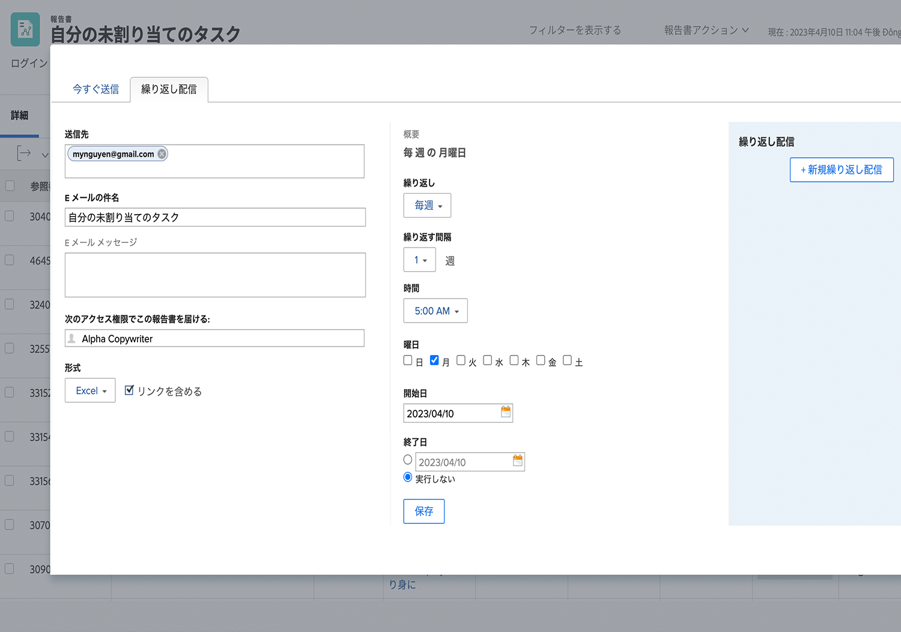

# レポートの送信と共有

このビデオでは、次のことを学習します。

* ユーザー、チーム、またはメールアドレスにレポートを送信する方法
* すべてのユーザーとレポートを共有する方法
* Workfront レポートで受信者が表示および実行できること

>[!VIDEO](https://video.tv.adobe.com/v/335158/?quality=12)

## アクティビティ：レポートを送信する

レポートを毎週月曜日の午前 5 時に Excel スプレッドシートとして自分自身に送信します。これは、後でトレンドを確認するために使用できる週別レポートを自動的に収集する優れた方法です。

## 回答

1. 作成したレポートを表示し、**[!UICONTROL レポートのアクション]**&#x200B;メニューから「**[!UICONTROL レポートを送信]**」を選択します。
1. 「**[!UICONTROL 定期配信]**」タブをクリックします。
1. メールアドレスを「**[!UICONTROL 送信先]**」フィールドに入力します。
1. メールの件名を入力します。
1. 形式を Excel に変更します。
1. 「**[!UICONTROL 繰り返し]**」を[!UICONTROL 毎週]に設定します。
1. 「[!UICONTROL 時間]」を午前 5 時に設定します。
1. 「[!UICONTROL 繰り返し日]」を月曜に設定します。
1. 「**[!UICONTROL 保存]**」をクリックします。

>[!NOTE]
>
>新しい定期配信が右の[!UICONTROL 定期配信]パネルに表示されます。1 つのレポートに対して複数の配信を設定できます。すべての配信がここに表示されます。

**配信を削除する**

作成した配信を選択し、「削除」（「**[!UICONTROL 保存]**」ボタンの隣）をクリックします。
