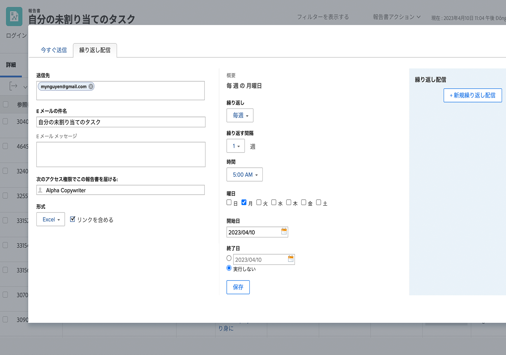

# レポートを効果的に送信して共有

このビデオでは、次のことを学習します。

* ユーザー、チーム、またはメールアドレスにレポートを送信する方法
* すべてのユーザーとレポートを共有する方法
* Workfront レポートで受信者が表示および実行できること

>[!VIDEO](https://video.tv.adobe.com/v/335158/?quality=12&learn=on&enablevpops=0)

## 重要な留意点

* **外部ユーザーへのレポートの送信：** Workfront以外のユーザーにレポートを送信するには、電子メールアドレスを入力します。これにより、組織外のユーザーと簡単にデータを共有できます。 &#x200B;
* **アクセス権限管理の可視性：** レポートの受信者の表示は、設定したアクセス権によって異なり、データセキュリティと適切な表示が保証されます。 &#x200B;
* **スナップショットの配信の繰り返し：** スケジュールされた配信では、特定の時間にデータの固定スナップショットが提供されます。これは、傾向の追跡やプロジェクトデータの履歴の維持に役立ちます。 &#x200B;
* **チームとレポートを共有：** レポートは、個人、チーム、または担当業務と共有して、表示または管理権限を付与できます。 &#x200B;共有レポートは、「自分と共有」セクションに表示されます。 &#x200B;
* **パブリックおよびシステム全体での共有：**&#x200B;外部ユーザーとパブリックリンクを介してレポートを共有したり、Workfront ユーザー全員がシステム全体でレポートを表示できるようにしたりして、データを柔軟に共有できます。

## 「レポートの送信と共有」アクティビティ

### アクティビティ 1：レポートの送信

レポートを毎週月曜日の午前 5 時に Excel スプレッドシートとして自分自身に送信します。 これは、後でトレンドを確認するために使用できる週別レポートを自動的に収集する優れた方法です。

### 回答 1

1. 作成したレポートを表示し、**[!UICONTROL レポートのアクション]**&#x200B;メニューから「**[!UICONTROL レポートを送信]**」を選択します。
1. 「**[!UICONTROL 定期配信]**」タブをクリックします。
1. メールアドレスを「**[!UICONTROL 送信先]**」フィールドに入力します。
1. メールの件名を入力します。
1. 形式を Excel に変更します。
1. 「**[!UICONTROL 繰り返し]**」を[!UICONTROL 毎週]に設定します。
1. 「[!UICONTROL 時間]」を午前 5 時に設定します。
1. 「[!UICONTROL 繰り返し日]」を月曜に設定します。
1. 「**[!UICONTROL 保存]**」をクリックします。

>[!NOTE]
>
>新しい定期配信が右の[!UICONTROL 定期配信]パネルに表示されます。 1 つのレポートに対して複数の配信を設定できます。すべての配信がここに表示されます。

**配信を削除する**

作成した配信を選択し、「削除」（「**[!UICONTROL 保存]**」ボタンの隣）をクリックします。
