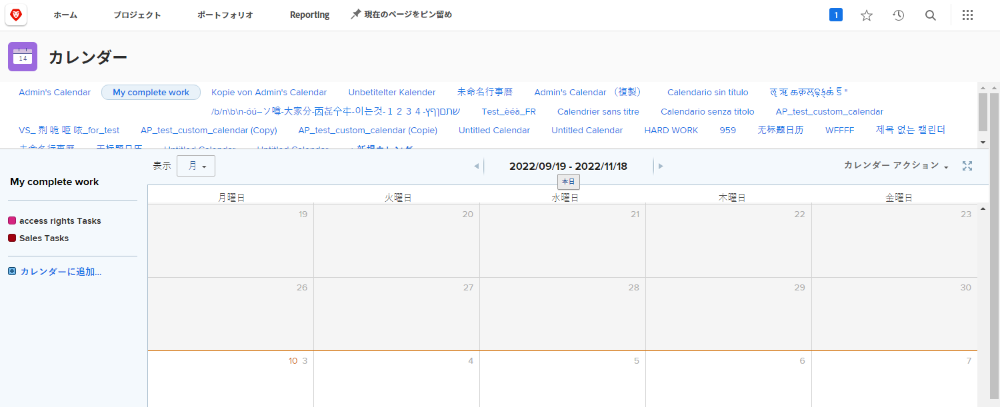
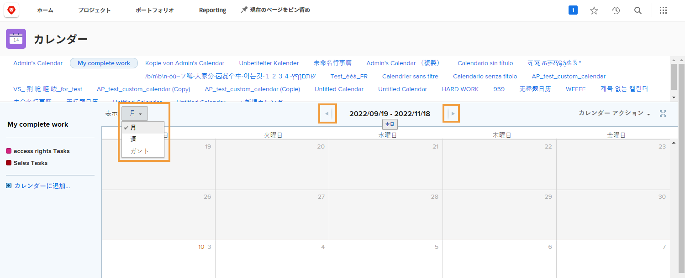
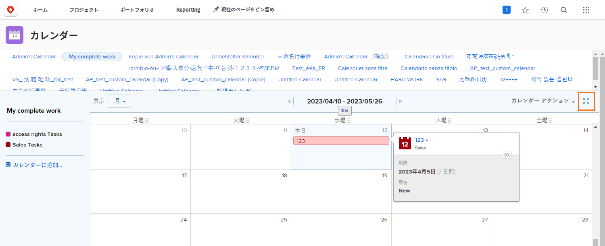
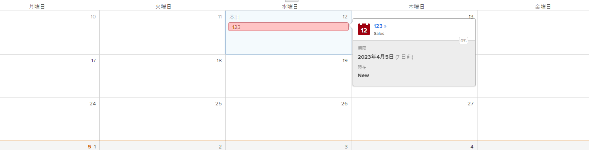
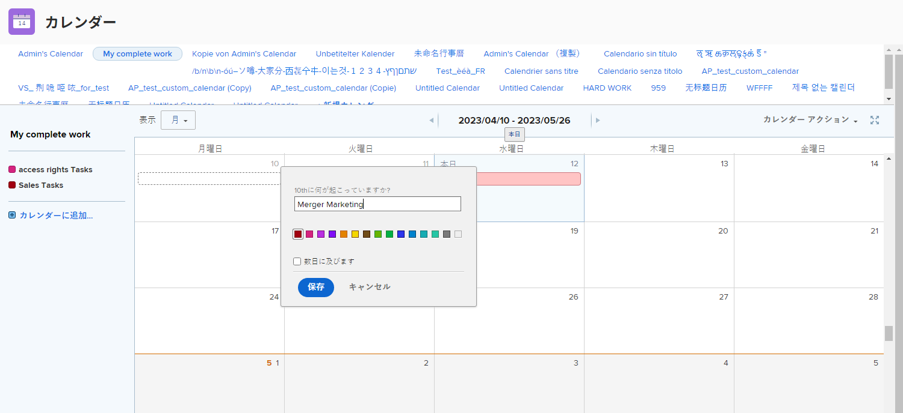

# カレンダーインターフェイスについて

この節では、以下について説明します。

* カレンダーのグループ化
* カレンダービュー
* カレンダーアクションメニュー
* アドホックカレンダー項目の作成方法

独自のカスタムカレンダーを作成する前に、カスタムカレンダーで使用できる基本的な機能について説明します。

## カレンダーのグループ化

1 つのカレンダーを個別の作業アイテムグループに整理できます。各グループ化はオンとオフを切り替えることができるので、ユーザーはいつでも最も重要な作業アイテムに集中できます。

## カレンダービュー

カレンダーは、月、週、[!UICONTROL ガント]形式で表示できます。カレンダー内を移動するには、横のスクロールバーまたは上部の矢印を使用します。[!UICONTROL ガント]ビューを使用すると、作業を別の視点から表示できます。最適なビューを検索します。

![[!UICONTROL ガント]ビューでのカレンダー画面の画像](assets/calendar-1-1bb.png)

## [!UICONTROL カレンダーアクション]メニュー

他の作業アイテムと同様に、カレンダーには[!UICONTROL アクション]メニューがあり、カレンダーで週末を表示したり、カレンダーを削除またはコピーしたり、個々の Workfront ユーザー、システム全体、外部ユーザーとカレンダーを共有したり、カレンダーを[!UICONTROL お気に入り]メニューに追加したりできます。

![[!UICONTROL カレンダーアクション]画面の画像](assets/calendar-1-1c.png)

## フルスクリーンモード

フルスクリーンアイコンをクリックして、カレンダーをフルスクリーンモードで表示します。 元のサイズに戻すには、再度クリックします。

## 概要情報

カレンダーで項目を選択すると、名前、元のプロジェクト、ステータス、割り当て、進捗ステータス、期日など、その項目の概要の詳細が表示されます。

## アドホックイベント

ダブルクリックして、カレンダーにアドホックイベントを作成し、スケジュールや他の作業アイテムを表します。

>[!NOTE]
>
>アドホックイベントを作成しても、Workfront にタスクは作成されません。

