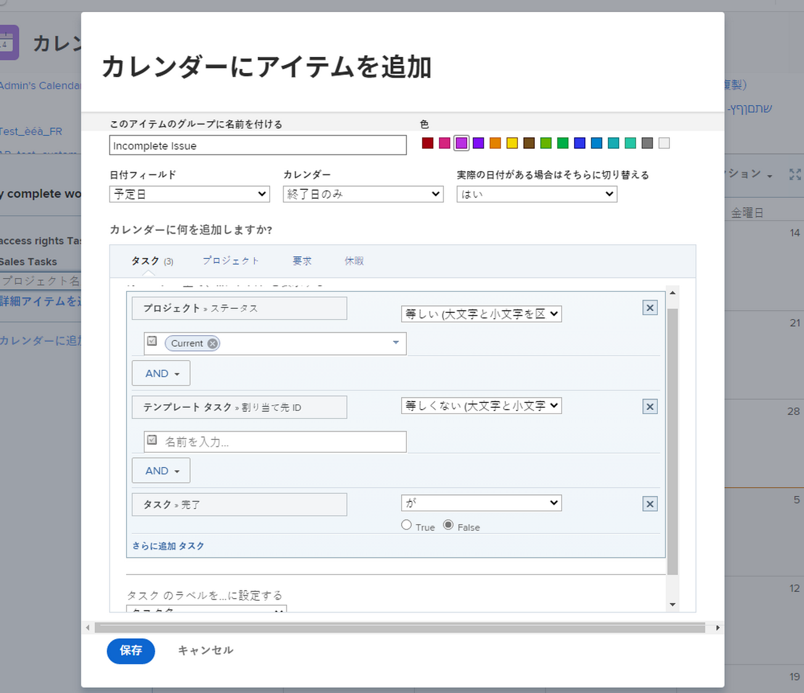
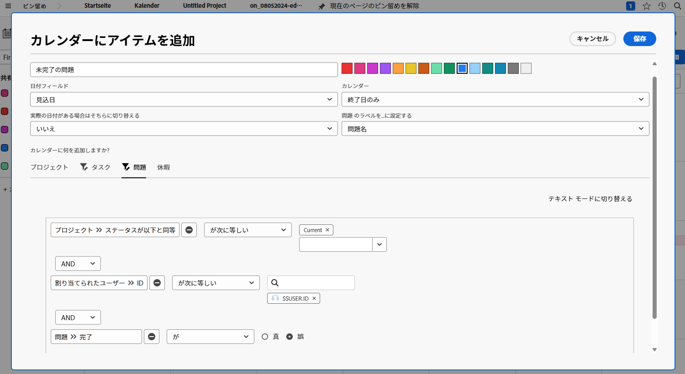
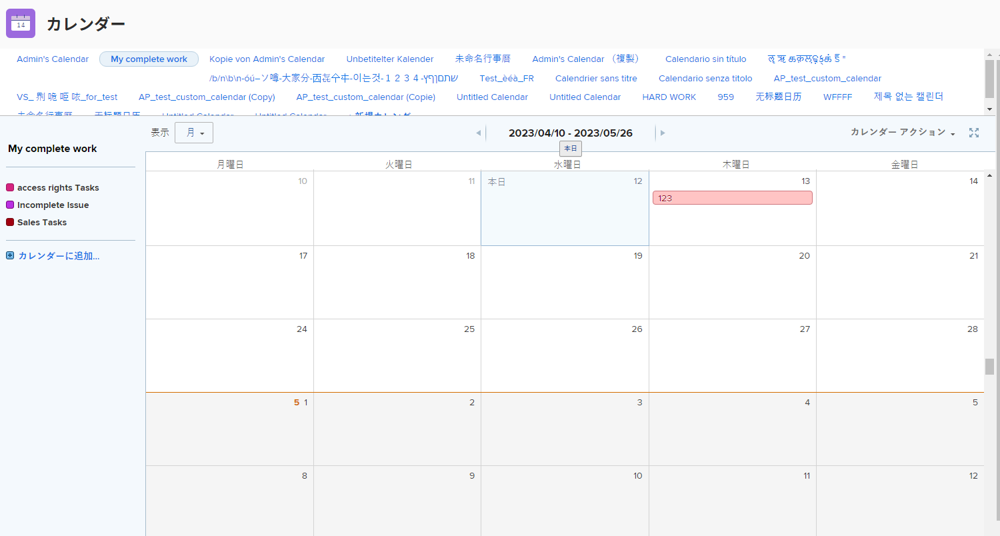

# カレンダーを作成する順番

このアクティビティでは、独自のカレンダーを作成した経験を活用できます。

## アクティビティ：カレンダーの作成

「My Incomplete Work」という名前の顧客カレンダーを作成します。

「現在のプロジェクト」で割り当てられているすべての未完了タスクを示す、「未完了タスク」という名前のカレンダーグループを含めます。

これらの項目の色として、赤を選択します。

「現在のプロジェクト」で割り当てられた未完了の問題をすべて示す、「未完了の問題」という名前の別のカレンダーグループを含めます。 これらの項目の色として、青を選択します。

## 回答

1. メインメニューからカレンダー領域に移動します。
1. [ 新しいカレンダー ] ボタンをクリックし、カレンダーに「My Incomplete Work」と名前を付けます。
1. 最初のグループの下で、「詳細項目を追加」をクリックします。
1. ポップアップ表示されるカレンダーに項目を追加ウィンドウで、グループに「不完全なタスク」という名前を付けます。
1. 色として赤を選択します。
1. 「日付」フィールドを「計画日」に変更します。
1. カレンダーの [ 終了日 ] フィールドを [ 終了日のみ ] に設定します。
1. [ 切り替え ] を [ 使用可能な場合は実際の日付に切り替え ] フィールドに [ いいえ ] を設定します。

   

1. [ カレンダーに追加する項目を選択してください。 セクションで、「タスク」を選択します。
1. 次の 3 つのフィルタールールを追加します。

   * プロジェクト/ステータスの「次と等しい」 > 「現在」
   * 割り当てユーザー/ ID /次と等しい > $$USER.ID
   * タスク > 完了 > 次と等しい > False

1. 「保存」をクリックします。

   

1. 「カレンダーに追加」をクリックして、2 番目のグループを作成します。
1. このグループの下で、「詳細項目を追加」をクリックします。
1. ポップアップ表示されるカレンダーに項目を追加ウィンドウで、グループに「未完了の問題」と名前を付けます。
1. 色として青を選択します。
1. 「日付」フィールドを「計画日」に変更します。
1. カレンダーの [ 終了日 ] フィールドを [ 終了日のみ ] に設定します。
1. [ 切り替え ] を [ 使用可能な場合は実際の日付に切り替え ] フィールドに [ いいえ ] を設定します。
1. [ カレンダーに追加する項目を選択してください。 セクションで、「問題」を選択します。
1. 次の 3 つのフィルタールールを追加します。

   * プロジェクト/ステータスの「次と等しい」 > 「現在」
   * 割り当てユーザー/ ID /次と等しい > $$USER.ID
   * 問題 > 完了 > 次と等しい > False

1. 「保存」をクリックします。

   

フィルターで$$USER.ID を使用しているので、このカレンダーを他のユーザーと共有して、自分の不完全なタスクや問題を他のユーザーと表示することができます。
