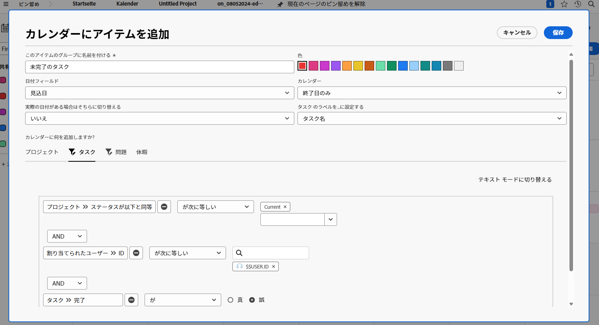

# アクティビティ – カレンダーレポートの作成

「マイ未完了タスク」という名前の顧客カレンダーを作成します。

「進行中のプロジェクト」で割り当てられているすべての未完了タスクを示す、「未完了タスク」という名前のカレンダーグループを含めます。

これらの項目の色として、赤を選択します。

「進行中のプロジェクト」で割り当てられているすべての未完了イシューを示す、「未完了イシュー」という名前の別のカレンダーグループを含めます。これらの項目のカラーで青色を選択します。

## 回答

1. メインメニューからカレンダーエリアに移動します。
1. 「新規カレンダー」ボタンをクリックし、カレンダーに「マイ未完了タスク」と名前を付けます。
1. 「カレンダーに追加」ボタンをクリックしてから、「詳細アイテムを追加」をクリックします。
1. ポップアップ表示されるカレンダーにアイテムを追加ウィンドウで、グループに「未完了タスク」という名前を付けます。
1. カラーで赤色を選択します。
1. 「日付」フィールドを「予定日」に変更します。
1. カレンダーの「終了日」フィールドを「終了日のみ」に設定します。
1. 「利用可能な場合は実際の日付に切り替える」フィールドを「いいえ」に設定します。
1. カレンダーに何を追加しますか？セクションで、「タスク」を選択します。次に、「タスクを追加」ボタンをクリックします。
1. 次の 3 つのフィルタールールを追加します。

   * プロジェクト／ステータスが次と等しい／等しい／現在
   * 割り当てユーザー／ID／次と等しい／$$USER.ID
   * タスク／完了／次と等しい／False

1. 「保存」をクリックします。

   

1. 「カレンダーに追加」をクリックし、次に「詳細アイテムを追加」をクリックして、2 番目のグループを作成します。
1. ポップアップ表示されるカレンダーにアイテムを追加ウィンドウで、グループに「未完了イシュー」と名前を付けます。
1. 色として青を選択します。
1. 「日付」フィールドを「予定日」に変更します。
1. カレンダーの「終了日」フィールドを「終了日のみ」に設定します。
1. 「利用可能な場合は実際の日付に切り替える」フィールドを「いいえ」に設定します。
1. カレンダーに何を追加しますか？セクションで、「イシュー」を選択します。次に、「イシューを追加」ボタンをクリックします。
1. 次の 3 つのフィルタールールを追加します。

   * プロジェクト／ステータスが次と等しい／等しい／現在
   * 割り当てユーザー／ID／次と等しい／$$USER.ID
   * イシュー／完了／次と等しい／False

1. 「保存」をクリックします。

   

フィルターで $$USER.ID を使用しているので、このカレンダーを他のユーザーと共有して、自分の不完全なタスクやイシューを他のユーザーと表示することができます。
