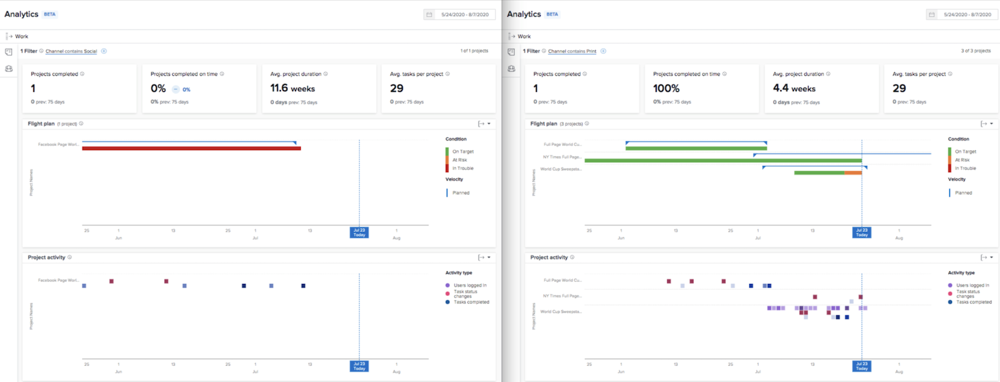

# KPI について

このビデオでは、次のことを学習します。

* KPI データから値を取得する方法

>[!VIDEO](https://video.tv.adobe.com/v/335046/?quality=12&learn=on&enablevpops=1)

## KPI の比較

KPI は、現在の状況に関する貴重な情報を提供するだけでなく、時間の経過に伴うアクティビティの変化や、ポートフォリオ、プログラム、プロジェクト所有者、または使用されているその他のフィルターの違いをユーザーが比較できるようにします。

例えば、2 つのブラウザータブに分析を取り込むと、KPI を比較できます。
