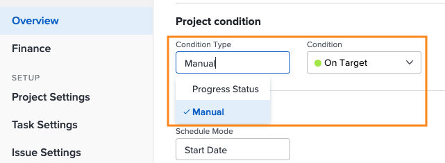

# プロジェクトの移動とレビューについて

このビデオでは、次のことを学習します。

* フライトプランチャートの読み方

>[!VIDEO](https://video.tv.adobe.com/v/335047/?quality=12&learn=on)

## フライトプランチャート

チャートには、次の情報が表示されます。

1. プロジェクト名は左側に表示されます。
1. 日付は下部全体にわたって表示されます。
1. 青い縦線は、マウスカーソルがある箇所の具体的な日付を示します。
1. 青い横線は、プロジェクトの予定開始日と終了日を示します。
1. 緑色の線は、プロジェクトが「目標通り」であることを示します。
1. オレンジ色の線は、プロジェクトが「危険」であることを示します。
1. 赤い線は、プロジェクトが「問題あり」であることを示します。

プロジェクトに関するこの情報を確認することで、次の項目を特定するのに役立ちます。

* 予定完了日を過ぎてプロジェクトを延長したイベント。
* プロジェクトでイシューが発生し始めたタイミング。
* 同じ期間にわたってオープンになっているプロジェクトの数。
* アクティブなプロジェクトの数。
* 特別な注意やサポートを必要とするプロジェクト。

## 状態は進捗ステータスに基づいています

プロジェクトの状態は、プロジェクトの進捗を視覚的に表現したものです。Workfront は、プロジェクト内のタスクの進捗ステータスに基づいて状態を決定します。

プロジェクトの状態は、次のように設定できます。

* プロジェクトの状況タイプが手動に設定されている場合、プロジェクトを管理するアクセス権限を持つユーザーによって&#x200B;**手動で**&#x200B;行われます。これにより、プロジェクトの状態をクリティカルパスとは別個に設定できます。
* Workfront によって&#x200B;**自動で**、プロジェクトの状態タイプが「進捗ステータス」に設定されている場合。

Workfront では、状態タイプを「進捗ステータス」に設定することをお勧めします。そうすることで、タスクの進捗に基づいて、プロジェクトの本当の進行状況が明確に示されます。

「進捗ステータス」に設定すると、プロジェクト状況は次のようになります。

* **目標通り** - クリティカルパスの最後のタスクの進捗ステータスが「時間通り」の場合、プロジェクトの状態は「目標通り」になります。 プロジェクトはスケジュール通りに完了する見込みです。
* **危険** - クリティカルパス上の最後のタスクの進捗ステータスが「遅れている」または「危険」の場合、プロジェクトの状態は「危険」になります。プロジェクトは遅れて完了する見込みですが、今はまだ遅れていません。
* **問題あり** - クリティカルパス上の最後のタスクの進捗ステータスが「遅延」の場合、プロジェクトの状態は「問題あり」になります。期限が過去の日付で、プロジェクトが現在遅れています。

>[!NOTE]
>
>状態は環境に合わせてカスタマイズできるので、3 つ以上のオプションが見つかったり、名称が上記のものとは異なる場合があります。状況のカスタマイズについては、[カスタム状況の作成または編集](https://experienceleague.adobe.com/docs/workfront/using/administration-and-setup/customize/custom-conditions/create-edit-custom-conditions.html?lang=ja)を参照してください。
