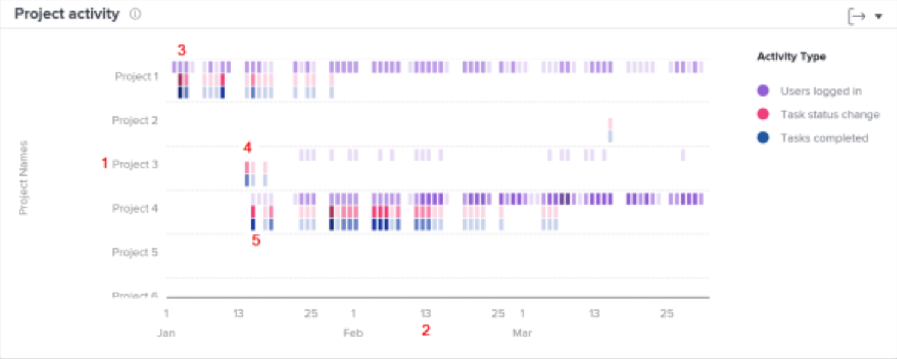

# プロジェクトアクティビティの移動とレビューについて

このビデオでは、次のことを学習します。

* ログインしたユーザー、タスクステータスの変更、完了したタスクに基づいてプロジェクトを比較する方法

>[!VIDEO](https://video.tv.adobe.com/v/335049/?quality=12&learn=on&enablevpops=1)

## プロジェクトの作業の比較

プロジェクトアクティビティのグラフでは、ログインしたユーザー、タスクステータスの変更、完了したタスクなどのプロジェクトアクティビティを把握し、Workfront の他のプロジェクトと付け合わせて比較できます。 プロジェクトアクティビティは様々な色で表示され、一定期間のアクティビティの概要がまとめられています。

この情報を確認することで、次の項目を特定するのに役立ちます。

* 特定のプロジェクトのアクティビティ。
* 他のプロジェクトと比較した、あるプロジェクトのアクティビティ。
* プロジェクトで作業しているユーザーと作業頻度。

グラフでは、次の情報を確認できます。

1. 左側にプロジェクト名。
1. 日付は下部全体にわたって表示されます。
1. 紫色の四角は、プロジェクトに割り当てられているユーザーがその日にログインしたことを表しています。濃い色は、ログインしたユーザーの人数が多いことを示しています。
1. ピンク色の四角は、ユーザーがその日にプロジェクトのタスクのステータスを変更したことを表しています。濃い色は、変更されたタスクのステータスの件数が多いことを示しています。
1. 青色の四角は、ユーザーがプロジェクトのタスクを完了したことを示しています。濃い色は、完了したタスクの件数が多いことを示しています。
