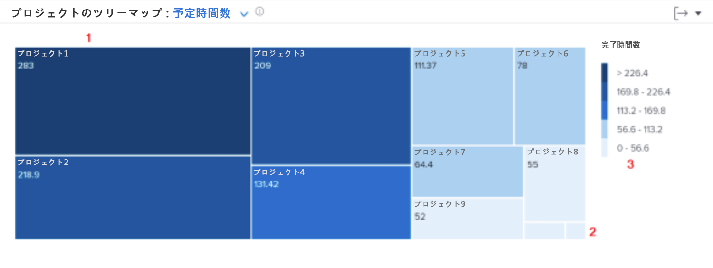

# のナビゲーションの詳細 [!UICONTROL 分析の強化]

このビデオでは、次のことを学習します。

* 各プロジェクトに対して作業者が割り当てられている時間をすばやく確認する方法

>[!VIDEO](https://video.tv.adobe.com/v/335050/?quality=12)

## プロジェクトでの滞在時間のレビュー

プロジェクトツリーマップを使用すると、ユーザーがプロジェクトに費やした時間を把握できます。 ボックスはプロジェクトを表します。 ボックスのサイズは、他のプロジェクトと比較して、プロジェクトに費やした時間を示します。 ボックスが大きいほど、より多くの時間が費やされます。

この情報を表示すると、次の項目を特定するのに役立ちます。

* 選択した日付範囲で作業中の項目の優先度。
* ユーザーが時間を費やしている対象。
* ユーザーが正しいことに注力している場合。
* 特定のプロジェクトが選択された期間にプロジェクトの範囲がどの程度変化したか。

グラフには、次の情報が表示されます。

1. フィルター処理した時間が長いプロジェクトは、大きなボックスと濃い青色で表されます。
1. 時間の経過が少ないフィルター処理済みのプロジェクトは、小さいボックスと明るい青色で表されます。
1. グラフの右側の凡例には、青の各シェードの完了時間の範囲が表示されます。
