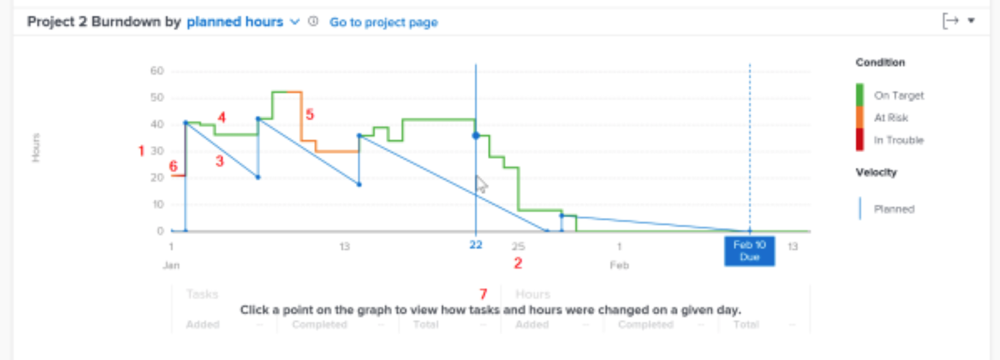

# バーンダウンのアクセスとレビューについて

このビデオでは、次のことを学習します。

* バーンダウンチャートへのアクセス方法
* プロジェクトの残り時間、プロジェクトの状態、プロジェクトの速度の間の関係を確認する方法

>[!VIDEO](https://video.tv.adobe.com/v/335051/?quality=12&learn=on)

## プロジェクトの速度の追跡

バーンダウンチャートを使用すると、プロジェクトの残り時間、状態、速度の関係を把握できます。 実線は、時間の経過に伴うプロジェクトの消費時間と、各日のプロジェクトの状態を示します。破線は、タスクの日付の変更に合わせて、開始日から予定完了日までの予定速度を示します。

この情報を確認することで、次の項目を特定するのに役立ちます。

* 発生する問題（予定外の作業）が、予定の作業にどのような影響を与えたか。
* 予定完了日を過ぎてプロジェクトを延長したイベントはどれか。

グラフでは、次の情報を確認できます。

1. 時間数が左側に表示されます。
1. 日付は下部に表示されます。選択した日付範囲にプロジェクトの予定完了日が含まれる場合は、その日付も表示されます。
1. 青い実線は、プロジェクトの速度（予定時間数または期間の経過）を示し、プロジェクトの予定完了日に達すると、破線の垂直線に変わります。
1. 緑色の線は、プロジェクトの状態が「目標通り」であることを示します。
1. オレンジ色の線は、プロジェクトの状態が「危険」であることを示します。
1. 赤い線は、プロジェクトの状態が「問題あり」であることを示します。
1. 特定の日のタスク数と時間数（合計、追加された量、完了した量）に関する情報は、グラフの特定のポイントをクリックすると X 軸の下に表示されます。
