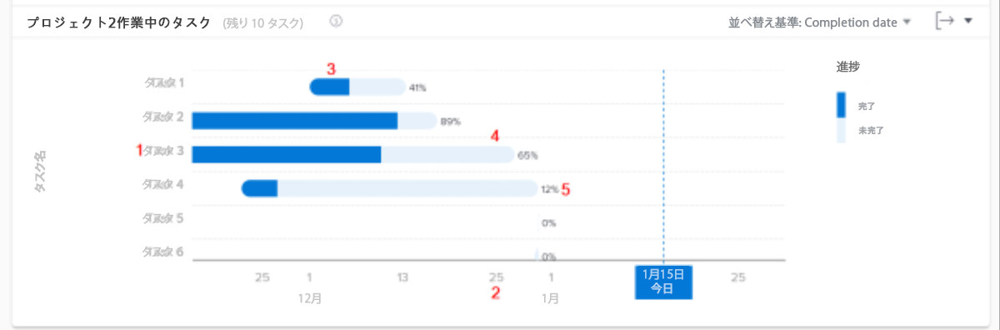

# 進行中のタスクのレビュー

このビデオでは、次のことを学習します。

* フライトチャートにアクセスする方法
* プロジェクトの未完了タスクをすぐに確認する方法

>[!VIDEO](https://video.tv.adobe.com/v/3437001/?captions=jpn&quality=12&learn=on&enablevpops=1)

## タスクレベルのデータ

「進行中のタスク」チャートでは、特定のプロジェクトのタスクを掘り下げて、各アクティブタスクの完了作業量とそれらのタスクがスケジュール通りであるかを確認できます。 チャートを使用すると、プロジェクトで完了する必要のあるタスクと、それらのタスクの完了率を把握できます。

この情報は、次の項目を判断する際に役立ちます。

* メンバーが何に取り組んでいるか。
* どのタスクがプロジェクトをリスクにさらす可能性があるか。
* タスクがどれだけ完了に近づいているか。
* 特定のタスクについて誰と話す必要があるか。

グラフでは、次の情報を確認できます。

1. 左側にタスク名が表示されます。
1. 下に日付が表示されます。
1. タスクバー内の濃い青色は、タスクの完了作業量を示します。
1. タスクバー内の薄い青色は、取り組むべきタスクの未完了作業量を示します。
1. タスクバーの右側の数値は、タスクの完了率を示します。
