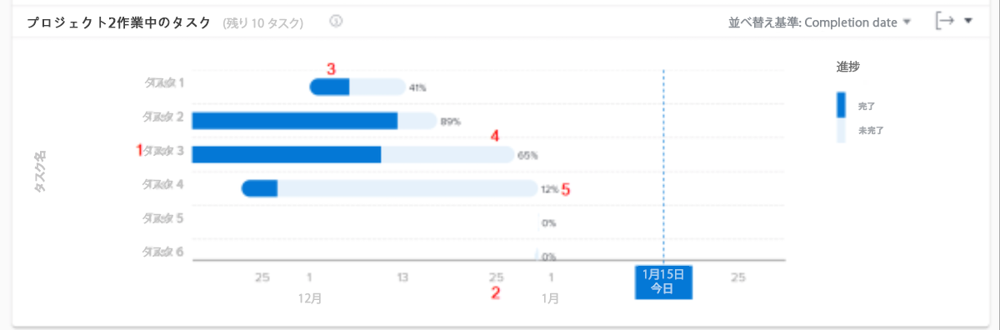

# 実行中のタスクを [!UICONTROL 分析の強化]

このビデオでは、次のことを学習します。

* フライトチャートでタスクにアクセスする方法
* プロジェクトで完了していないタスクをすばやく確認する方法

>[!VIDEO](https://video.tv.adobe.com/v/335052/?quality=12)

## タスクレベルのデータ

[ フライトチャートのタスク ] では、特定のプロジェクトのタスクを掘り下げて、アクティブな各タスクの完了作業量とタスクのスケジュールを確認できます。 グラフを使用すると、プロジェクトで完了する必要のあるタスクと、これらのタスクの完了率を把握できます。

この情報は、次の項目を判断する際に役立ちます。

* 人々が何に取り組んでいるか。
* プロジェクトのリスクを招く可能性のあるタスク。
* タスクが完了するまでにどの程度近いかを示します。
* 特定のタスクについて話す必要があるユーザー。

グラフには、次の情報が表示されます。

1. 左側のタスク名。
1. 一番下の日付。
1. タスクバー内の濃い青色は、タスクの完了作業時間を示します。
1. タスクバー内の明るい青色は、タスクの完了に必要な作業量を示します。
1. タスクバーの右側の数値は、タスクの完了率を示します。
