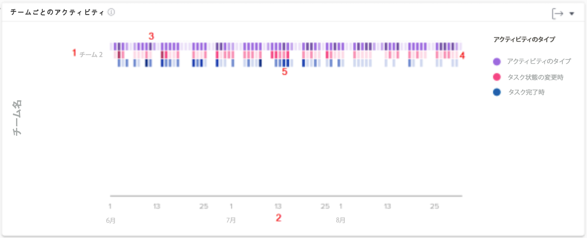

# チーム別アクティビティのグラフについて

チームごとのアクティビティのチャートを使用すると、組織のホームチームが Workfront でどのように時間を費やしているのかを把握できます。 Workfront のユーザーは複数のチームに参加できますが、参加できるホームチームは 1 つのみです。 人物チャートで使用されるチームは、そのチームがホームチームとして指定されたユーザーのみで構成されます。

アクティビティ（ユーザーのログイン、タスクのステータス変更、タスクの完了）は、フィルタリングされた期間中のこれらのイベントを要約して、異なるカラーで表示されます。

この情報を確認することで、次の項目を特定するのに役立ちます。

* ホームチーム内で発生しているアクティビティとその割合。
* どのホームチームがオーバーワークになっているか、またはシステムをより多く使用しているか。
* 作業の配分がホームチームに適しているか。

グラフでは、次の情報を確認できます。

1. 左側にホームチーム名があります。
1. 下部の日付は、選択した日付範囲に基づいています。
1. 紫色の四角は、プロジェクトに割り当てられているユーザーがその日にログインしたことを表しています。濃い色は、ログインしたユーザーの人数が多いことを示しています。
1. ピンク色の四角は、ユーザーがその日にプロジェクトのタスクのステータスを変更したことを表しています。濃い色は、変更されたタスクのステータスの件数が多いことを示しています。
1. 青色の四角は、ユーザーがプロジェクトのタスクを完了したことを示しています。濃い色は、完了したタスクの件数が多いことを示しています。

## グラフへの移動方法

1. 左側のパネルで「[!UICONTROL ユーザー]」タブをクリックします。
1. 「[!UICONTROL フィルター]」を使用して、調査する 1 つ以上のホームチームを選択します。
1. チームごとのアクティビティのチャートが、人物チャートの上部に表示されます。
