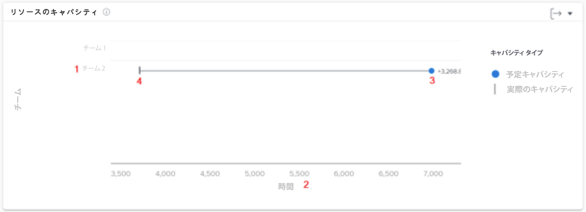
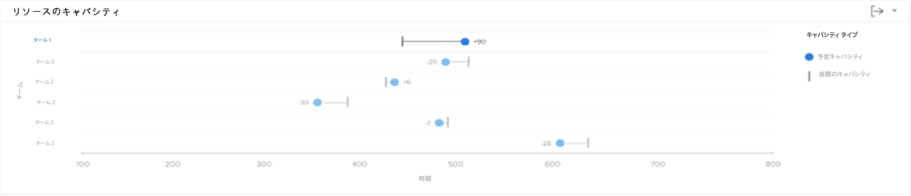

# リソース処理能力のグラフについて

リソース処理能力グラフには、チームの合計作業可能時間との比較における、フィルター処理された期間内にホームチームに割り当てられた予定時間数が表示されます。

この比較は、チームに十分な作業を割り当てているか、またはワークロードが多すぎてバーンアウトに陥っている可能性がないかを判断するのに役立ちます。チーム名をクリックすると、チームの処理能力グラフが表示され、フィルターを適用した期間のチームの処理能力の詳細が示されます。

この情報を確認することで、次の項目を特定するのに役立ちます。

* ホームチームが割り当て超過または割り当て不足の場合。
* 作業可能なホームチーム。

グラフには、次の主な詳細が表示されます：

1. ホームチームの名前が左側に表示されます。
1. 時間は下部に表示されます。これはグラフの X 軸で、上のチームに表示される時間範囲に対して計算されます。
1. この円は、ホームチームに割り当てられた予定時間数を示します。
1. 縦線は、ホームチームが使用できる合計時間数を示します。

## グラフへの移動方法

1. 左側のパネルで「[!UICONTROL ユーザー]」タブをクリックします。
1. 「[!UICONTROL フィルター]」を使用して、調査する 1 つ以上のホームチームを選択します。
1. [!UICONTROL リソースのキャパシティ]グラフが、チームのアクティビティグラフの下に表示されます。

## グラフの使用方法

Workfront の [!UICONTROL Enhanced Analytics] エリアでグラフにデータを表示するには、フィルターを追加して日付範囲を選択する必要があります。以前にフィルターを追加した場合、そのフィルターは削除するまで有効となります。

処理能力グラフでは、以下の操作を実行することができます。

* ホーム チームの行にカーソルを合わせると、まだスケジュール可能な時間数、ホームチームが完了する予定の時間数、合計作業時間数（超過、未満、またはフル稼動時）が表示されます。
* グラフの右上隅にある「書き出し」ボタンを使用して、グラフデータを書き出します。
* ホームチーム名をクリックして、チームの処理能力グラフを開きます。 チーム処理能力グラフで短い時間枠にズームインすると、リソース処理能力グラフに表示されるデータが更新されます。
