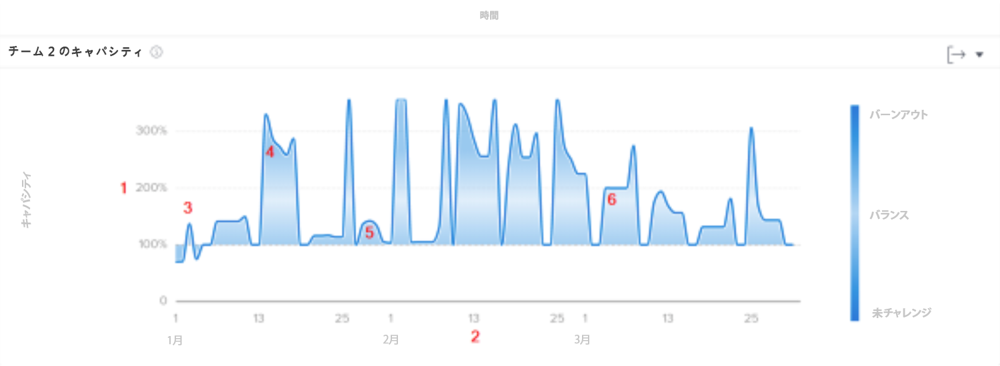
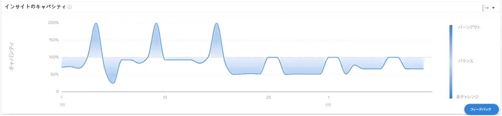

# でのチームの能力を理解する [!UICONTROL 分析の強化]

[ チームの能力 ] グラフには、ホームチームが過剰割り当てされたか、割り当てられていなかったかが表示されます。 このグラフには、特定の日にホームチームに割り当てられた作業量が表示され、燃え尽きた時や挑戦していない時に濃い青色が割り当てられます。 より明るく、より透明な色は、ワークロードのバランスがより高いことを示します。

この情報を表示すると、次の項目を特定するのに役立ちます。

* ホームチームが割り当て超過または割り当て不足になったとき。
* ホームチームが日々割り当て超過または割り当て不足になっている場合。
* ホームチームの作業負荷の一貫性が日々どの程度向上しているか。
* 新しい作業で容量の問題を発生させる場合。

グラフには、次の情報が表示されます。

1. ホームチームの定員の割合は左側です。
1. 下部の日付は、選択した日付範囲から取得されます。
1. 濃い青の塗りの色は、ホームチームが燃え尽き (4) を経験しているか、挑戦を受けていないことを示します。
1. 明るい青色またはより透明な青色は、ホームチームの作業負荷が均衡していることを示します

## グラフの使用方法

Analytics 領域の「人」セクションでグラフ上のデータを表示するには、フィルターを追加して、日付範囲を選択する必要があります。 以前にフィルターを追加した場合は、削除するまでアクティブになります。

[ チームの処理能力 ] グラフでは、次の操作を実行できます。

* グラフ上のポイントにマウスポインターを置くと、日付線が表示されます。
* グラフ化された線の上にマウスポインターを置くと、指定した日付の予定時間と予定時間、および能力の割合と、現時点でホームチームが終了したか、満たされていなかったか、または生産能力にあったかが表示されます。
* プロジェクトの特定のポイントをクリックし、マウスをドラッグして日付を拡大表示します。 （この操作により、他のすべてのグラフが更新され、同じ日付範囲で拡大表示されます）。
* グラフの右上隅にある「エクスポート」ボタンを使用して、グラフデータをエクスポートします。
