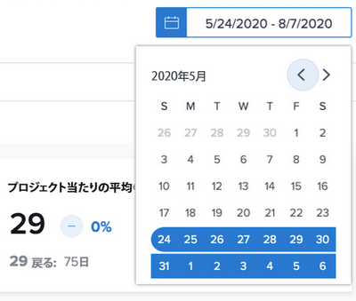

# 日付範囲と期間について

[!DNL Enhanced analytics] のグラフを表示する際、日付範囲はカレンダーウィジェットを使用して指定します。期間はグラフ内で、クリックやドラッグで特定のエリアを定義すると作成されます。作成されたら、ズームインして、その期間の情報をより詳しく確認できます。

## 日付範囲

カレンダー内の任意の日付をクリックして範囲の片方の日付を指定し、それから任意の日付をクリックして範囲のもう片方の日付を指定します。開始日と終了日が同じ月でない場合は、カレンダーの上部にある矢印を使って別の月に移動できます。

[!DNL Analytics] のグラフは、デフォルトで過去 60 日間と今後 15 日間のデータが表示されます。[!DNL Analytics] を使用している間に、新しい日付範囲を選択して、すべてのグラフに適用できます。

ページを更新したり、移動して離れたり、Workfront からログアウト／ログインしたりすると、日付範囲はデフォルトにリセットされます。

## 期間

タイムラインの目的のセクションのあたりをクリックしてドラッグし、期間フィルターを作成します。 すると、この期間が作業エリアのすべてのグラフに適用され、さらにフィルターバーの他のフィルターの横に表示されます。エリアをクリックおよびドラッグして期間を更新することで、グラフをさらに掘り下げて確認できます。期間フィルターを削除するには、フィルターバーでカーソルを合わせ、表示される「X」をクリックします。

ページを更新したり、移動して離れたり、Workfront からログアウトしたりすると、期間は削除され、日付範囲はリセットされます。

>[!NOTE]
>
>この期間オプションは、プロジェクトツリーマップグラフでは使用できません。
