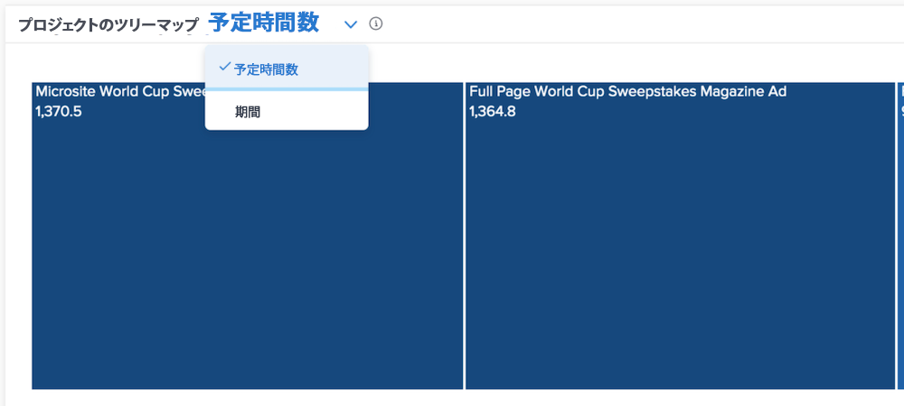

# 予定時間数ビューと期間ビューについて

バーンダウングラフとプロジェクトツリーマップのグラフでは、Workfront 環境でより正確と思える内容に応じて、予定時間数または期間で情報を表示できます。

デフォルトは予定時間数です。 期間に切り替えると、 [!DNL Analytics] から他へ移動して戻ってきた場合や、Workfront にログインし直した場合でも、期間に固定されています。

## ボックスのサイズと色合いの意味

より小さく、より明るい青色のボックスは、時間が短いことを示し、大きいボックスとより濃い青色のボックスは、比較して時間が長いことを示します。 詳しくは、[プロジェクトのツリーマップビジュアライゼーションについて](https://experienceleague.adobe.com/docs/workfront/using/reporting/enhanced-analytics/project-treemap-overview.html?lang=ja)を参照してください。
