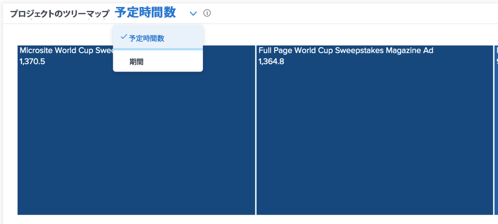

# [!UICONTROL Enhanced Analytics] の予定時間数ビューと期間ビューについて

バーンダウングラフとプロジェクトツリーマップのグラフでは、Workfront 環境でより正確と思える内容に応じて、予定時間数または期間で情報を表示できます。

デフォルトは予定時間数です。期間に切り替えると、 [!DNL Analytics] から他へ移動して戻ってきた場合や、Workfront にログインし直した場合でも、期間に固定されています。
