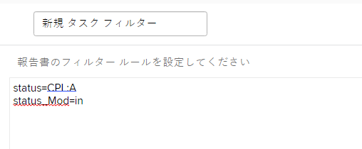

# フィルターの基本的なテキストモードについて

>[!IMPORTANT]
>
>前提条件：
>
>* レポート要素について
>* レポートコンポーネントについて
>* 基本フィルターの作成


このビデオでは、次のことを学習します。

* テキストモード
* ラクダの例とは
* レポートフィルターで使用できる基本的な「プラグアンドプレイ」テキストモード

>[!VIDEO](https://video.tv.adobe.com/v/336820/?quality=12)

次のテキストモードでは、ユーザーが「Done with My Part」とマークしたタスクが除外されます。 必要な操作は、タスクフィルターを作成し、必要なフィルタールールを追加してから、テキストモードに切り替えて、フィルターに表示される任意のテキストモードの後に下のコードを貼り付けるだけです。

```
EXISTS:1:$$OBJCODE=ASSGN  
EXISTS:1:taskID=FIELD:ID  
EXISTS:1:status=DN  
EXISTS:1:status_Mod=notin  
EXISTS:1:assignedToID=$$USER.ID 
```

## 追加のプラグ&amp;プレイテキストモードフィルター

### タスク — 承認待ちのすべてのタスクを表示する

```
approvalProcessID_Mod=notblank
currentUserApproversMM:ID=$$USER.ID
currentUserApproversMM:ID_Mod=in
currentUserApproversMM_Join=allowingnull
```

### タスク — 自分が承認したすべてのタスクを表示する

任意のフィルターでタスクレポートを作成し、「フィルター」タブに移動して、「テキストモードに切り替え」をクリックします。 既に存在するものにこのコードを追加します。

```
approvalProcessID_Mod=notblank
approverStatuses:approvedByID=$$USER.ID
approverStatuses:approvedByID_Mod=in
```

### タスク — 少なくとも 1 つのプロジェクト間の先行タスクを持つすべてのタスクを表示する

```
predecessorsMM:ID_Mod=notblank
predecessorsMM:projectID=FIELD:projectID
predecessorsMM:projectID_Mod=ne
```

### タスク — 自分が割り当てたすべてのタスクを表示する

任意のフィルターでタスクレポートを作成し、「フィルター」タブに移動して、「テキストモードに切り替え」をクリックします。 既に存在するものにこのコードを追加します。

```
EXISTS:1:$$OBJCODE=ASSGN
EXISTS:1:taskID=FIELD:ID
EXISTS:1:assignedByID=$$USER.ID
```

ログインしたユーザーが現在の担当者の 1 つ以上を割り当てたすべてのタスクが表示されます。 担当者が複数の担当者によって割り当てられた場合は、担当者を最初に割り当てた人の名前のみがタスクのランディングページに「担当者」と表示されます。

## アクティビティ：テキストモードに関する質問

1. 「ID で入力済み」というタイトルのフィールドのキャメルケースを作成する方法を教えてください。
1. 問題レポートで、フィルターを作成して、クローズ済みとマークされているが承認待ちの問題を表示します。

### 回答

1. 「ID 別に入力」フィールドのキャメルケースは、enteredByID のように記述する必要があります。
1. 問題レポートフィルターのテキストモードは次のようになります。

   
