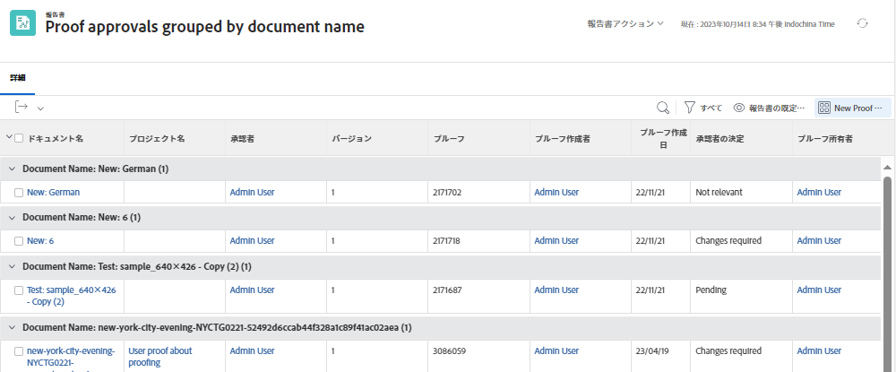

# グループ化の基本的なテキストモードについて

>[!PREREQUISITES]
>
>* [レポート要素について](https://experienceleague.adobe.com/docs/workfront-learn/tutorials-workfront/reporting/basic-reporting/reporting-elements.html?lang=ja)
>* [レポートコンポーネントについて](https://experienceleague.adobe.com/docs/workfront-learn/tutorials-workfront/reporting/basic-reporting/reporting-components.html?lang=ja)
>* [基本グループを作成](https://experienceleague.adobe.com/docs/workfront-learn/tutorials-workfront/reporting/basic-reporting/create-a-basic-grouping.html?lang=ja)


>[!TIP]
>
>* テキストモードをより深く理解するために、録画されたウェビナーイベント「[エキスパートに聞く - テキストモードレポートの概要](https://experienceleague.adobe.com/en/docs/events/classics/reporting-and-dashboards/introduction-to-text-mode-reporting)」（所要時間：1 時間）の視聴をお勧めします。
>* テキストモードの詳細については、[詳細なレポート](https://experienceleague.adobe.com/docs/workfront-learn/tutorials-workfront/reporting/advanced-reporting/welcome-to-advanced-reporting.html?lang=jp)のチュートリアルをご覧ください。このチュートリアルは合わせて 5 時間半です。
>* ここをクリックして、[[!UICONTROL API エクスプローラー]](https://developer.adobe.com/workfront/api-explorer/)にアクセスします

このビデオでは、次のことを学習します。

* テキストモードとは
* キャメルケースとは
* レポートのグループ化で使用できるいくつかの&#x200B;_テキストモードのコードブロック_

>[!VIDEO] （https://video.tv.adobe.com/v/3410641/?quality=12&learn=on&enablevpops=0

## 「グループ化の基本的なテキストモードについて」アクティビティ

### タスク - 4 つの親のグループ化

次のテキストモードでは、最大 4 つ上の親のレベルに基づいてタスクをグループ化し、存在しない親を空白のままにします。

```
textmode=true
group.0.name=Parents
group.0.valueexpression=CONCAT({parent}.{parent}.{parent}.{parent}.{name},IF(ISBLANK({parent}.{parent}.{parent}.{parent}.{name}),"",", "),{parent}.{parent}.{parent}.{name},IF(ISBLANK({parent}.{parent}.{parent}.{name}),"",", "),{parent}.{parent}.{name},IF(ISBLANK({parent}.{parent}.{name}),"",", "),IF(ISBLANK({parent}.{name}),"No parent",{parent}.{name}))
group.0.linkedname=parent
group.0.namekeyargkey.0=parent
group.0.namekeyargkey.1=name
group.0.valueformat=string
```


### タスク - 完了率のグループ化

次のテキストモードでは、完了率に基づいてタスクをグループ化します。 タスクはグループ化されると、次のカテゴリのいずれかに分類されます。

* 0％
* 1～25％
* 26～50％
* 51～75％
* 76～99％
* 100%

```
group.0.linkedname=direct
group.0.namekey=percentComplete
group.0.valueexpression=IF({percentComplete}<1,"0%",IF({percentComplete}<26,"1% to 25%",IF({percentComplete}<51,"26% to 50%",IF({percentComplete}<76,"51% to 75%",IF({percentComplete}<100,"76% to 99%",IF({percentComplete}=100,"100","***"))))))
group.0.valueformat=doubleAsString
textmode=true
```


### タスク - statusEquatesWith、ステータスの順

次のテキストモードは、タスクを statusEquatesWith でグループ化してから、ステータスでグループ化します。

```
group.0.enumclass=com.attask.common.constants.TaskStatusEnum
group.0.enumtype=TASK
group.0.linkedname=direct
group.0.name=State
group.0.type=enum
group.0.valuefield=statusEquatesWith
group.0.valueformat=val
group.1.enumclass=com.attask.common.constants.TaskStatusEnum
group.1.enumtype=TASK
group.1.linkedname=direct
group.1.namekey=status
group.1.type=enum
group.1.valuefield=status
group.1.valueformat=val
textmode=true
```


### プルーフの承認 - プロジェクト名でグループ化

```
group.0.valueformat=HTML
group.0.valuefield=documentVersion:document:project:name
group.0.displayname=Project Name
```


### プルーフの承認 - ドキュメント名でグループ化

```
group.0.displayname=Document Name
group.0.valuefield=documentVersion:document:name
group.0.valueformat=HTML
```



