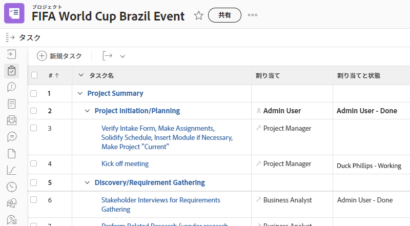
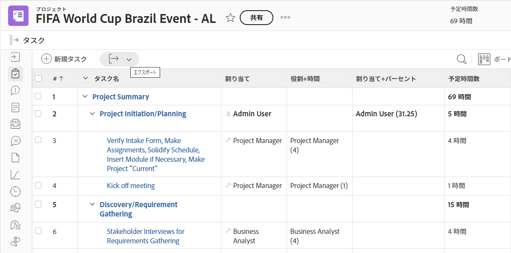
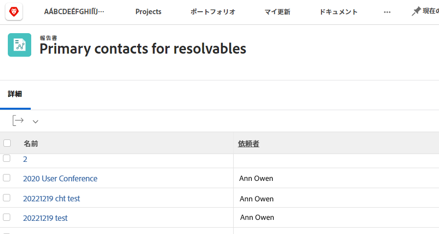
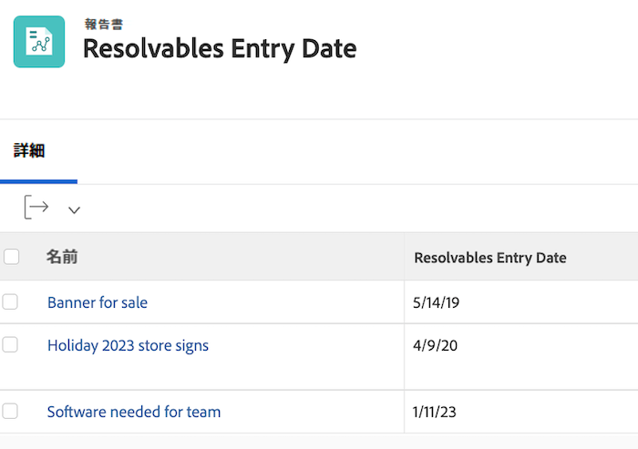
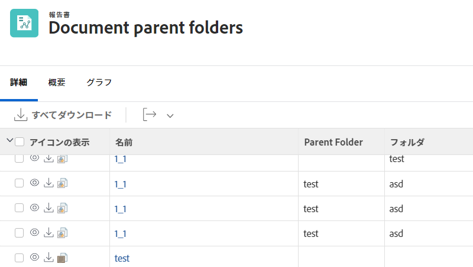
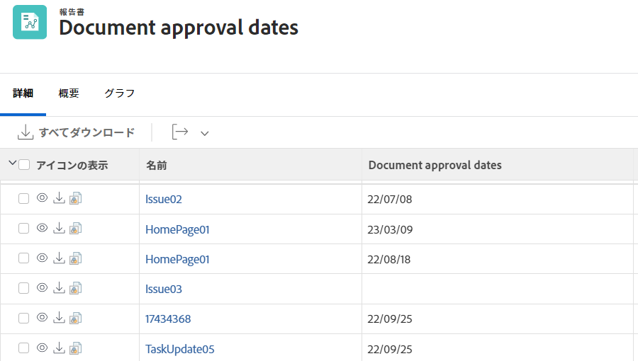

# ビューの基本的なテキストモードについて


>[!PREREQUISITES]
>
>* [レポート要素について](https://experienceleague.adobe.com/docs/workfront-learn/tutorials-workfront/reporting/basic-reporting/reporting-elements.html?lang=ja)
>* [レポートコンポーネントについて](https://experienceleague.adobe.com/docs/workfront-learn/tutorials-workfront/reporting/basic-reporting/reporting-components.html?lang=ja)
>* [基本ビューの作成](https://experienceleague.adobe.com/docs/workfront-learn/tutorials-workfront/reporting/basic-reporting/create-a-basic-view.html?lang=ja)


>[!TIP]
>
>* テキストモードをより深く理解するために、録画されたウェビナーイベント「[エキスパートに聞く - テキストモードレポートの概要](https://experienceleague.adobe.com/en/docs/events/classics/reporting-and-dashboards/introduction-to-text-mode-reporting)」（所要時間：1 時間）の視聴をお勧めします。
>* テキストモードの詳細については、[詳細なレポート](https://experienceleague.adobe.com/docs/workfront-learn/tutorials-workfront/reporting/advanced-reporting/welcome-to-advanced-reporting.html?lang=jp)のチュートリアルをご覧ください。このチュートリアルは合わせて 5 時間半です。
>* ここをクリックして、[[!UICONTROL API エクスプローラー]](https://developer.adobe.com/workfront/api-explorer/)にアクセスします

このビデオでは、次のことを学習します。

* テキストモードとは
* キャメルケースとは
* レポートビューで使用できるいくつかの&#x200B;_テキストモードのコードブロック_

>[!VIDEO] （https://video.tv.adobe.com/v/3410571/?quality=12&learn=on&enablevpops=0

## 「ビューの基本的なテキストモードについて」アクティビティ

### タスク - 4 つ上の親のビュー

最初にタスクの名前と親の名前の列を作成し、次のテキストモードを使用して他の 3 つの列を作成します。

#### タスク - 親の親（2 つ上の親）の名前

```
displayname=Parent of Parent Name
linkedname=parent
namekey=view.relatedcolumn
namekeyargkey.0=parent
namekeyargkey.1=name
querysort=parent:parent:name
textmode=true
valuefield=parent:parent:name
valueformat=HTML
```

#### タスク - 親の親の親（3 つ上の親）の名前

```
displayname=Parent of Parent of Parent Name
linkedname=parent
namekey=view.relatedcolumn
namekeyargkey.0=parent
namekeyargkey.1=name
querysort=parent:parent:parent:name
textmode=true
valuefield=parent:parent:parent:name
valueformat=HTML
```

#### タスク - 親の親の親の親（4 つ上の親）の名前

```
displayname=Parent of Parent of Parent of Parent Name
linkedname=parent
namekey=view.relatedcolumn
namekeyargkey.0=parent
namekeyargkey.1=name
querysort=parent:parent:parent:parent:name
textmode=true
valuefield=parent:parent:parent:parent:name
valueformat=HTML
```


### ユーザー - ユーザービューでリストを表示するイテレーション

#### ユーザー - すべての担当業務

```
displayname=All job roles
listdelimiter=<p>
listmethod=nested(userRoles).lists
textmode=true
type=iterate
valuefield=role:name
valueformat=HTML
```

#### ユーザー - プライマリを示すすべての担当業務

```
displayname=All Job Roles showing primary
listdelimiter=<p> 
listmethod=nested(userRoles).lists 
textmode=true
type=iterate 
valueexpression=IF({user}.{roleID}={role}.{ID},CONCAT("** ",{role}.{name}," **"),{role}.{name})
valueformat=HTML
```

#### ユーザー - すべてのチーム

```
displayname=All teams
listdelimiter=<p>
listmethod=nested(teams).lists
textmode=true
type=iterate
valueexpression={name}
valueformat=HTML
```

>[!NOTE]
>
>UI からアクセスできるチームフィールドがあり、すべてのチームをコンマで区切って表示しますが、上のテキストモードを使用すると、各チームが別々の行に表示されます。


#### ユーザー - すべてのグループ

```
displayname=All groups
listdelimiter=<p>
listmethod=nested(userGroups).lists
textmode=true
type=iterate
valuefield=group:name
valueformat=HTML
```

#### ユーザー - ホームグループを表示するすべてのグループ

```
displayname=All groups showing home group
listdelimiter=<p>
listmethod=nested(userGroups).lists
textmode=true
type=iterate
valueexpression=IF({user}.{homeGroupID}={group}.{ID},CONCAT("** ",{group}.{name}," **"),{group}.{name})
valueformat=HTML
```


#### ユーザー - ダイレクトレポート

```
displayname=Direct reports
listdelimiter=<p>
listmethod=nested(directReports).lists
textmode=true
type=iterate
valueexpression={name}
valueformat=HTML
```

#### ユーザー - 将来の PTO

```
displayname=Future PTO
listdelimiter=<br>
listmethod=nested(reservedTimes).lists
namekey=group.plural
textmode=true
type=iterate
valueexpression=IF({startDate}>$$TODAY,CONCAT({startDate}," - ",{endDate}),"")
valueformat=HTML
width=150
```


### タスク - タスクの割り当ての表示とステータスの操作

```
displayname=Assignments and Status
listdelimiter=<br>
listmethod=nested(assignments).lists
namekey=group.plural
textmode=true
type=iterate
valueexpression=CONCAT({assignedTo}.{name},IF(ISBLANK({assignedTo}.{name}),"",IF({status}="AA"," - Requested",IF({status}="AD"," - Working"," - Done"))))
valueformat=HTML
width=150
```




### タスク - 複数のタスクの割り当てに関する役割と割り当てを表示する方法

#### タスク - 役割と時間数

```
displayname=Role+hours
listdelimiter=<li>
listmethod=nested(assignments).lists
textmode=true
type=iterate
valueexpression=CONCAT({role}.{name}," (",round({workRequired}/60,2),")")
valueformat=HTML
```

#### タスク - 割り当てと割り当て率

```
displayname=Assignment+percent
valueexpression=CONCAT({assignedTo}.{name}," (",{assignmentPercent},")")
listdelimiter=<li>
listmethod=nested(assignments).lists
valueformat=HTML
textmode=true
type=iterate
```



### タスク - プロジェクト間の先行タスクと後続タスク

#### タスクフィルター（オプション）

**現在のプロジェクトで、1 つ以上のプロジェクト間の先行タスクまたは 1 つ以上のプロジェクト間の後続タスクを持つすべてのタスクを表示**

```
predecessorsMM:ID_Mod=notblank
predecessorsMM:projectID=FIELD:projectID
predecessorsMM:projectID_Mod=ne
project:statusEquatesWith=CUR
project:statusEquatesWith_Mod=in
OR:1:project:statusEquatesWith=CUR
OR:1:project:statusEquatesWith_Mod=in
OR:1:successorsMM:ID_Mod=notblank
OR:1:successorsMM:projectID=FIELD:projectID
OR:1:successorsMM:projectID_Mod=ne
```

#### タスク - プロジェクトの先行タスク名と先行タスクが次の場所にあることを表示

```
displayname=Predecessor names
listdelimiter=<br>
listmethod=nested(predecessors).lists
namekey=group.plural
textmode=true
type=iterate
valueexpression=CONCAT("TASK = ",{predecessor}.{name}," >> PROJECT = ",{predecessor}.{project}.{name})
valueformat=HTML
width=150
```

#### タスク - プロジェクトの後続タスク名と後続タスクが次の場所にあることを表示

```
displayname=Successor names
listdelimiter=<br>
listmethod=nested(successors).lists
namekey=group.plural
textmode=true
type=iterate
valueexpression=CONCAT("TASK = ",{successor}.{name}," >> PROJECT = ",{successor}.{project}.{name})
valueformat=HTML
width=150
```

#### タスク - 先行タスクの完了日の見込みを表示

```
displayname=Predecessor projected completion dates
valueformat=atDate
listdelimiter=
textmode=true
width=90
stretch=0
valuefield=predecessor:projectedCompletionDate
type=iterate
listmethod=nested(predecessors).lists
shortview=false
```

#### タスク - 先行タスクの進捗ステータスを表示

```
displayname=Predecessor progress status
listdelimiter=<br>
listmethod=nested(predecessors).lists
shortview=false
stretch=0
textmode=true
type=iterate
valueexpression=IF({predecessor}.{progressStatus}="OT","On Time",IF({predecessor}.{progressStatus}="LT","Late",IF({predecessor}.{progressStatus}="BH","Behind","At Risk")))
valueformat=HTML
width=90
```

#### タスク - プロジェクト間の先行タスクのプロジェクト完了率を表示

```
displayname=Predecessor project percent complete
listdelimiter=<br>
listmethod=nested(predecessors).lists
namekey=group.plural
textmode=true
type=iterate
valueexpression=IF({isCP}=true,CONCAT({predecessor}.{project}.{percentComplete},"%"),"")
valueformat=HTML
width=150
```


### タスク - 割り当てられた担当者と、割り当てを行った担当者をすべて示すイテレーション

```
displayname=All assignees and requesters
listdelimiter=<p>
listmethod=nested(assignments).lists
textmode=true
type=iterate
valueexpression=CONCAT("Assigned To: ",{assignedTo}.{name},"; Requested By: ",{assignedBy}.{name})
valueformat=HTML
```


### タスクまたはプロジェクト - プロジェクトまたはタスク上のすべてのカスタムフォームを表示するイテレーション

```
displayname=All Forms Assigned
listdelimiter=<p>
listmethod=nested(objectCategories).lists
textmode=true
type=iterate
valuefield=category:name
valueformat=HTML
```


### プロジェクト - プロジェクトビューで解決可能なすべてのプライマリ連絡先を示すイテレーション

```
displayname=Requestor
listdelimiter=<br>
listmethod=nested(resolvables).lists
namekey=group.plural
textmode=true
type=iterate
valuefield=owner:name
valueformat=HTML
width=150
```



### プロジェクト - すべてのプロジェクトチームメンバーを示すイテレーション

```
displayname=Project Team Members
listdelimiter=<br>
listmethod=nested(projectUsers).lists
namekey=group.plural
textmode=true
type=iterate
valuefield=user:name
valueformat=HTML
```


### プロジェクト - プロジェクトで解決可能なすべてのイシューの entryDate を示すイテレーション

```
displayname=Resolvables entry date
linkedname=direct
listdelimiter=<br>
listmethod=nested(project.resolvables).lists
listsort=string(description)
querysort=description
section=0
textmode=true
type=iterate
valuefield=entryDate
valueformat=HTML
```



### プロジェクト - 元のプロジェクトリクエスタのホームグループを示します

```
displayname=Requestor home group
linkedname=direct
namekey=name
querysort=convertedOpTaskOriginator:homeGroup:name
textmode=true
valuefield=convertedOpTaskOriginator:homeGroup:name
valueformat=HTML
```


### プロジェクト - プロジェクトがリクエストキューであるかどうかを示します

```
querysort=queueDef:isPublic
valueformat=val
description=0 (None), 1 (Public), 2 (Private), 3 (Company), 4 (Group)
linkedname=direct
textmode=true
enumtype=PROJ
valuefield=queueDef:isPublic
namekey=status
type=enum
enumclass=com.attask.common.constants.ProjectStatusEnum
displayname=Public Selection
```


### イシュー - すべての解決プロジェクトチームメンバーを示すイテレーション

```
displayname=Resolve Project: Team Members
listdelimiter=<br>
listmethod=nested(resolveProject.projectUsers).lists
namekey=group.plural
textmode=true
type=iterate
valuefield=user:name
valueformat=HTML
width=150
```


### イシュー - イシューのプライマリ連絡先のすべてのチームを示すイテレーション

```
displayname=Requestor Teams
listdelimiter=<br>
listmethod=nested(owner.teams).lists
namekey=group.plural
textmode=true
type=iterate
valuefield=name
valueformat=HTML
width=150
```


### ドキュメント - ドキュメントレポートのフォルダーを示すイテレーション

```
displayname=Folder
listdelimiter=<br><br>
listmethod=nested(folders).lists
textmode=true
type=iterate
valuefield=name
valueformat=HTML
```


### ドキュメント - ドキュメントレポートの親フォルダーを示すイテレーション

```
displayname=Parent Folder
listdelimiter=<br><br>
listmethod=nested(folders).lists
textmode=true
type=iterate
valuefield=parent:name
valueformat=HTML
```



### ドキュメント - ドキュメントの承認日

```
displayname=Document approval dates
valueformat=HTML
listdelimiter=<br>
linkedname=direct
textmode=true
listsort=string(description)
valuefield=approvalDate
type=iterate
listmethod=nested(approvals).lists
shortview=false
section=0
```



### プルーフの承認

#### プルーフの承認 - プロジェクト名を示します

```
displayname=Project Name
textmode=true 
valuefield=documentVersion:document:project:name 
valueformat=HTML
```

#### プルーフの承認 - タスク名を示します

```
displayname=Task Name
textmode=true 
valuefield=documentVersion:document:task:name 
valueformat=HTML
```


