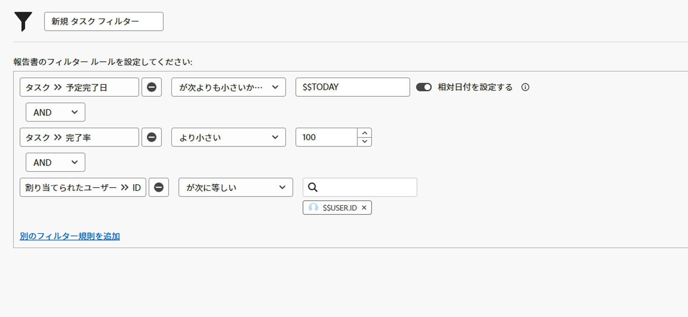

# 日付ベースのワイルドカードを使用したフィルターの作成

このビデオでは、次の方法を学習します：

* 日付ベースのワイルドカードを使用するタイミングを理解する
* Workfront で使用する 2 つの日付ベースのワイルドカードの違いを理解する
* 日付ベースのワイルドカードをフィルターに追加する
* ワイルドカード、属性、演算子、修飾子を使用してカスタム日付を作成する
* ワイルドカードを使用してカスタムの日付範囲を作成する

>[!VIDEO](https://video.tv.adobe.com/v/336812/?quality=12&learn=on&enablevpops)

## アクティビティの設問

1. イシューの期限を昨日または今日に設定するとしたら、どのようにフィルタールールを作成しますか？
1. 期限が先週のプロジェクトを検索するとしたら、どのようにフィルタールールを作成しますか？
1. 次のフィルタルールは、定期的に使用するタスクレポートの一部です。このレポートから得られるのは、どのようなタイプの結果ですか？

## 解答

1. イシューの予定完了日を [!UICONTROL $$TODAY-1d] と [!UICONTROL $$TODAY] の間でフィルタリングします。
1. プロジェクトの予定完了日を [!UICONTROL $$TODAYb-1w] と [!UICONTROL $$TODAYe-1w] の間でフィルタリングします。
1. このレポートは、自分に割り当てられていて、まだ完了していない（つまり、完了率が 100 未満である）、期限を過ぎているか期限が今日のタスクを検索します。タスクの予定完了日のフィルタールールは、期限が本日以前のタスクを調べるという意味です。
