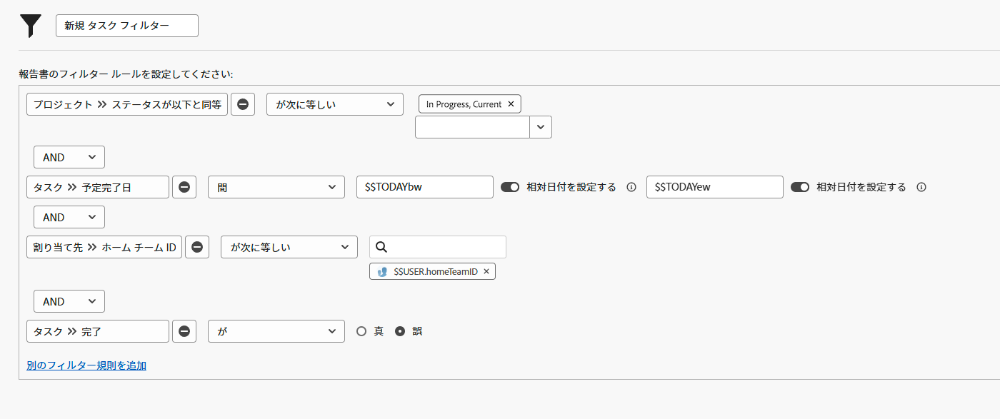

# ユーザーベースのワイルドカードを使用してフィルターを作成する

このビデオでは、次の方法を学習します：

* ワイルドカードを使用する理由について
* ユーザーベースのワイルドカードを使用してフィルターを作成する

>[!VIDEO](https://video.tv.adobe.com/v/336810/?quality=12)

>[!TIP]
>
>タスクまたはイシューの割り当て情報を調べるフィルターを作成する際は、割り当てられたユーザー／ID フィールドソースと名前を使用します。 このオプションでは、「所有者」やメイン担当者だけでなく、タスクまたはイシューに割り当てられたすべてのユーザーを確認できます。

>[!TIP]
>
>自分でフィルターを作成する場合でも、$$USER.ID（名前の代わりに）を使用します。 そうすることで、あるユーザーが実行しているフィルターを見た別のユーザーが、「それを共有して」と言った場合でも、フィルターは既に設定されているので、使用している各ユーザーが自分の情報を確認できます。

>[!TIP]
>
>ユーザーベースのワイルドカードを使用する場合は、常に「次に等しい」フィルター修飾子を使用する必要があります。

## アクティビティ

今週は少し時間があるので、チームに割り当ての手伝いを探している人がいるかどうかを確認したいと考えています。タスクフィルターを作成して、期限が今週であるがまだ完了していないタスクを検索します。

## 回答

チームメイトを手助けできます！下の画像のようにフィルターが設定されている場合、次のタスクが見つかります。

* 未完了（つまり、[!UICONTROL 完了]ステータスまたは[!UICONTROL 完了]に等しいステータスを持たない）
* [!UICONTROL 現在]ステータスのプロジェクトに属する（まだ開始していないプロジェクトのタスクは見つけたくない）
* Workfront チームの設定で定義されたホームチームの誰かに割り当てられている
* 完了日が今週のどこか（このルールでは、「今週」を定義するために事前定義済の日付フィルターを使用）

リストをもう少し限定する必要がある場合は、フィルターを追加する必要があるでしょう。 例えば、チームが取り組む特定のプログラムやポートフォリオを調べるフィルタールールを追加したいかもしれません。
