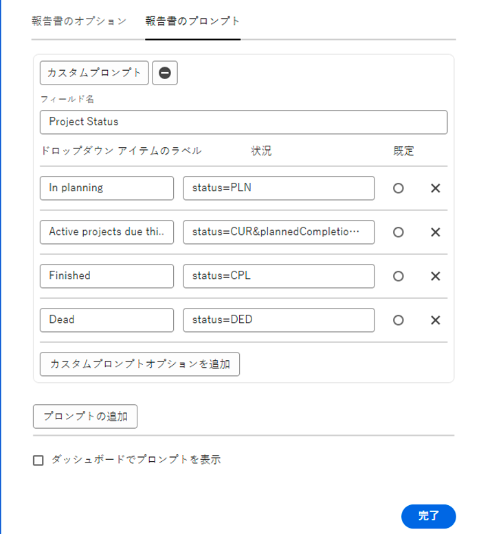

# カスタムプロンプトの作成

このビデオでは、次のことを学習します。

* カスタムプロンプトの概要
* テキストモードを使用したカスタムプロンプトの作成方法
* レポートで使用できる例

>[!VIDEO](https://video.tv.adobe.com/v/336822/?quality=12&learn=on&enablevpops=0)

## 「カスタムプロンプトの作成」アクティビティ


### アクティビティ：カスタムプロンプトの作成

1. プロンプトのドロップダウンメニューで次のプロジェクトステータスを表示するカスタムプロンプトを作成します。
   * 計画
   * 現在
   * 完了
   * 停止
1. プロンプトを変更して、今月が期限の現行プロジェクトを表示します。

### 解答

1. カスタムプロンプトは次のように表示され、次のテキストモードになります。

   

   カスタムプロンプトを保存すると、プロンプトのドロップダウンメニューは次のように表示されます。

1. カスタムプロンプトのテキストモードは次のように表示されます。


```
   status=CUR&plannedCompletionDate=$$TODAYbm&plannedCompletionDate_Mod=between&plannedCompletionDate_Range=$$TODAYem 
```

また、次のようなコードの変更を反映するように、アクティブなプロンプトのドロップダウンラベルを更新する必要があります。


