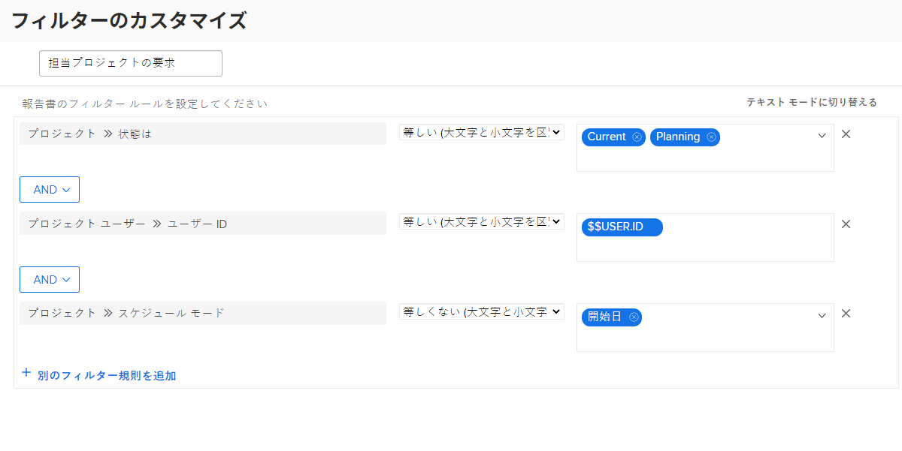
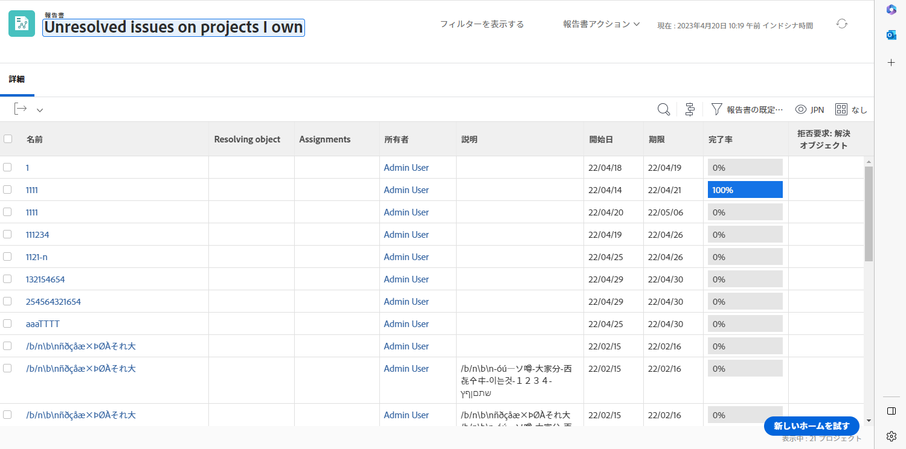

# ビルトインイシューフィルターについて

このビデオでは、次の操作を実行します。

* ビルトインイシューフィルターをレビューして、その仕組みを確認する
* いくつかの便利なイシューレポート要素について学ぶ
* 独自のイシューフィルターを作成する方法を学ぶ

>[!VIDEO](https://video.tv.adobe.com/v/3412680/?quality=12&learn=on&captions=jpn)

## 「ビルトインイシューフィルターについて」アクティビティ

### アクティビティ：イシューレポートの作成

解決中のオブジェクトに関するイシューを含め、自分が所有するすべてのアクティブなプロジェクトでまだ解決する必要があるすべてのイシューを確認します。 イシューレポートを作成し、「自分が所有するプロジェクトでの未解決のイシュー」という名前を付けます。

### 回答

フィルターは次のようになります。

「自分の未解決のイシュー」ビルトインフィルターでは、フィルタールールの 1 つが、解決中のオブジェクトがあるすべてのイシューを除外していました。 この背後にある理由は、これらのイシューについて心配する必要がないということです。 誰かが既に、それを解決するプロジェクトやタスク、イシューを作成しているので、何を心配する必要があるでしょう。 ただし、イシューはまだ解決されていません。この例では、それらを含めることにより、どのように動作しているかを簡単に特定して確認できるようにしています。

これを行うには、「イシュー／オブジェクトの解決」の「ビュー」タブに列を追加する必要があります。 これは、プロジェクト、タスク、イシューのいずれであっても、解決オブジェクトがある場合はその名前を示します。 名前をクリックすると、解決オブジェクトに移動します。

プロジェクトの名前に基づいてリストをグループ化できます。

レポートは次のようになります。

