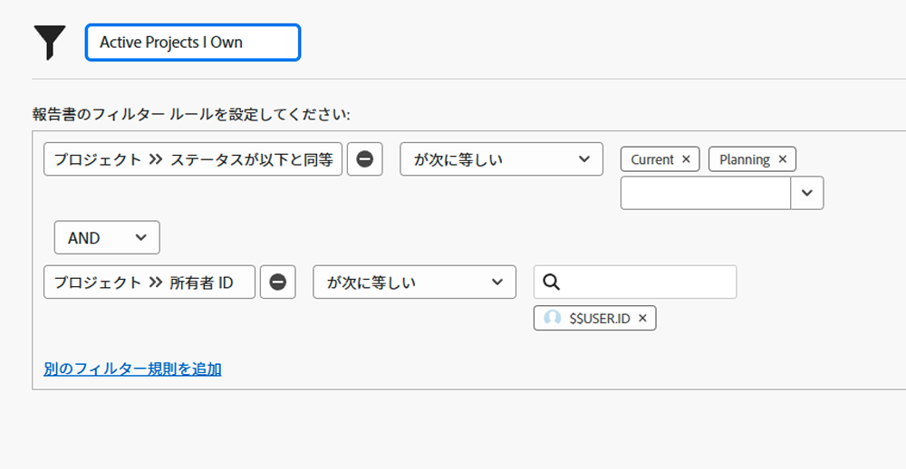

# ビルトインプロジェクトフィルターについて

このビデオでは、以下の方法を説明します。

* ビルトインプロジェクトフィルターをレビューして、その仕組みを確認する
* 学習した内容を使用して独自のプロジェクトフィルターを作成

>[!VIDEO](https://video.tv.adobe.com/v/336817/?quality=12&learn=on&enablevpops=0)

## 「ビルトインプロジェクトフィルターについて」アクティビティ

### アクティビティ：プロジェクトフィルターの作成

自分が所有しているアクティブプロジェクトをすべて表示したいと考えています。ここでの「アクティブ」は、プロジェクトステータスが「計画中」または「進行中」と同等の意味を示しています。 プロジェクトエリアで、「所有しているアクティブプロジェクト」という名前のプロジェクトフィルターを作成します。

### 回答

フィルターは次のようになります。

特定のプログラムやポートフォリオ内のプロジェクトを検索するなど、追加のフィルタールールを含めることができます。 その場合、Workfront でフィルターの名前を「マーケティングポートフォリオで所有しているアクティブプロジェクト」などの適切でわかりやすい名前に変更することをお勧めします。
