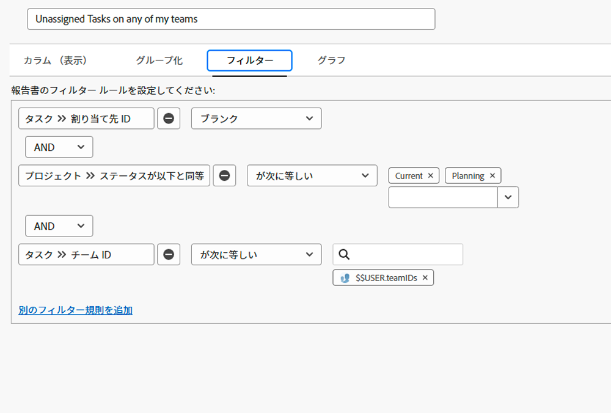
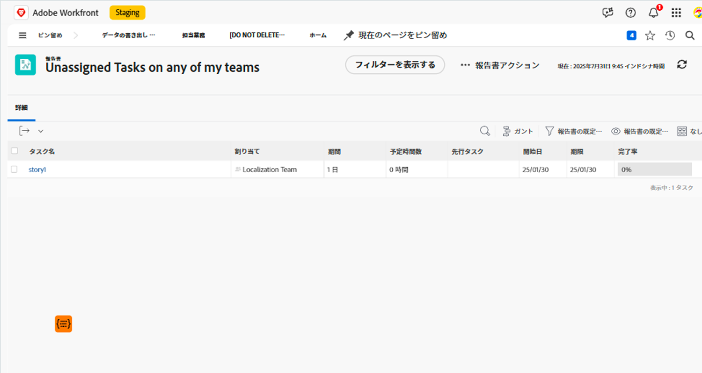

# ビルトインタスクフィルターについて

このビデオでは、次の操作を実行します。

* ビルトインタスクフィルターをレビューして、その仕組みを確認する
* いくつかの便利なタスクレポート要素について学ぶ
* 独自のタスクフィルターを作成する方法を学ぶ

>[!VIDEO](https://video.tv.adobe.com/v/336818/?quality=12&learn=on)

## 「ビルトインタスクフィルターについて」アクティビティ

### アクティビティ：タスクレポートの作成

自分のチームの 1 つに割り当てられているけれど、まだ誰も作業することに同意していないタスクについて、把握できていることを確認したいとします。 「自分のチームのいずれかで割り当てられていないタスク」という名前のタスクレポートを作成します。

### 回答

フィルターは次のようになります。

目的のフィールドや、インライン編集を可能にしたいフィールドを含めるよう列ビューを設定します。 例えば、チームメンバーをレポートから直接タスクに割り当てられるよう、「割り当て」列を含めることができます。

各タスクに割り当てられたチームの名前に基づいてリストをグループ化する必要が出ることがあります。

レポートは次のようになります。

