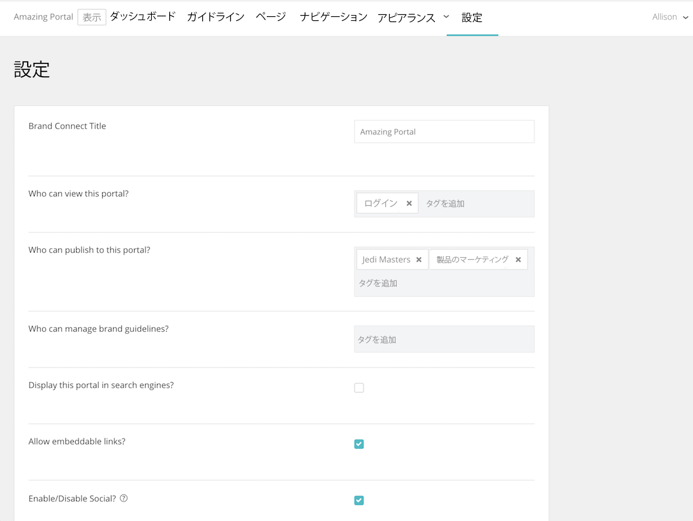

# [!UICONTROL Brand Connect] でのシステム設定の確立

この [!UICONTROL Brand Connect] 設定は、ポータルの閲覧者、ポータルへのコンテンツの公開者、ブランドガイドラインの管理者を制御します。

設定にアクセスするには、次の場所にログインします。 [!UICONTROL Workfront DAM].

1. 次をクリック： **設定アイコン** ナビゲーションバーで「 」を選択し、 **[!UICONTROL Brand Connect]**. または、 **[!UICONTROL ブランド]** をクリックします。
1. 次に、 **[!UICONTROL 編集]** オプション [!UICONTROL Brand Connect] パネル。 組織に複数の [!UICONTROL ブランドの接続]を編集する場合は、適切なものを編集していることを確認します。

お問い合わせ [!UICONTROL Workfront] コンサルタントにお問い合わせください。

* **[!UICONTROL Brand Connect] タイトル** — 名前を [!UICONTROL Brand Connect] （または名前を変更）。
* **このポータルを表示できるユーザー**— [!UICONTROL Brand Connect]. 例えば、 [!UICONTROL ログイン済み] グループ化すると、ログインしているすべてのユーザーがポータルを表示できます。 ただし、フォルダー権限は引き続き適用されるので、ユーザーがポータルを表示できる場合でも、アセットにアクセスするには、 [!UICONTROL ログイン済み] グループにフォルダーに対する権限が付与されました。
* **このポータルに公開できるユーザー** — にアセットを公開できるグループを設定します。 [!UICONTROL Brand Connect]. これらは寄稿者グループになります。 ユーザーがアクセスできる項目のみを公開できます。
* **ブランドガイドラインは誰が管理できますか？** — ブランドガイドラインを管理できるグループを設定します。 ガイドラインの管理は、管理者ユーザーに限定されません。 コントリビューターグループを設定して、ガイドラインを編集できます。
* **このポータルを検索エンジンに表示しますか？** — 望みは？ [!UICONTROL Brand Connect] ユーザーがインターネット上で検索を実行したときに表示する URL
* **埋め込み可能なリンクを許可しますか？** — 埋め込み可能なリンクは [!UICONTROL Brand Connect]? これにより、 [!UICONTROL リンクの取得] パネルから [!UICONTROL 共有] アセットの埋め込み可能なリンクを提供するメニュー。
* **ソーシャルを有効にする/無効にする**— Social が有効な場合（チェックボックスをオンにする）、ユーザーはアセットに対して「いいね！」をし、コメントを付けることができます。
* **ダウンロード数と閲覧数を有効/無効にしますか？** — 有効にすると、ユーザーはアセットがダウンロードされた回数とコメント数を確認できます。
* **最初にファセットを非表示** — 左パネルの [!UICONTROL Assets] ページ。
* **Lightbox ラベル** — ラベルを選択します。 [!UICONTROL Lightbox] — [!UICONTROL Lightbox], [!UICONTROL コレクション], [!UICONTROL お気に入り]または [!UICONTROL お気に入り].
