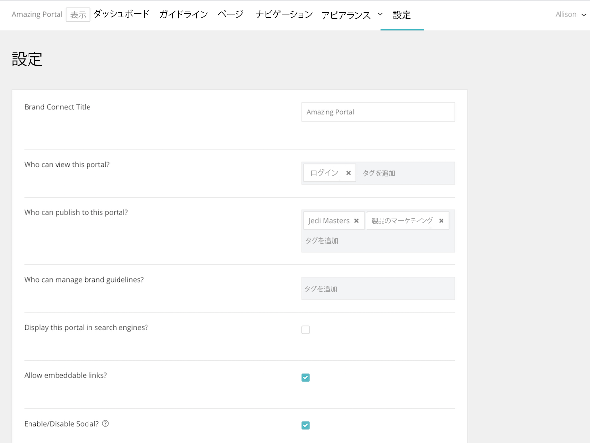

# [!UICONTROL Brand Connect] でのシステム設定の確立

[!UICONTROL Brand Connect] 設定では、ポータルを閲覧できるユーザー、ポータルにコンテンツを公開できるユーザー、ブランドガイドラインを管理できるユーザーを制御します。

設定にアクセスするには、[!UICONTROL Workfront DAM] にログインします。

1. ナビゲーションバーの&#x200B;**設定アイコン**&#x200B;をクリックし、**[!UICONTROL Brand Connect]** を選択します。 または、ナビゲーションバーで「**[!UICONTROL ブランド]**」をクリックします。
1. 次に、[!UICONTROL Brand Connect] パネルの右上隅にある「**[!UICONTROL 編集]**」オプションをクリックします。 組織に複数の [!UICONTROL Brand Connect] がある場合は、正しいものを編集していることを確認してください。

これらの設定についてのご質問については、[!UICONTROL Workfront] コンサルタントにお問い合わせください。

* **[!UICONTROL Brand Connect] のタイトル** - [!UICONTROL Brand Connect] という名前を付けます（または名前を変更します）。
* **誰がこのポータルを表示できますか？**— [!UICONTROL Brand Connect]を表示できるグループを設定します。 例えば、[!UICONTROL ログイン済み]グループを追加すると、ログインしているすべてのユーザーがポータルを閲覧できるようになります。 ただし、フォルダー権限は引き続き適用されるので、ユーザーがポータルを閲覧できる場合でも、[!UICONTROL ログイン済み]グループにフォルダーへの権限が付与されていない限り、アセットにはアクセスできません。
* **誰がこのポータルに公開できますか？** - アセットを公開できるグループを[!UICONTROL Brand Connect]に設定します。 これらは投稿者グループになります。 自分がアクセスできる項目のみを公開できます。
* **ブランドガイドラインを管理できるのは誰ですか？** – ブランドガイドラインを管理できるグループを設定します。 ガイドラインの管理は、管理者ユーザーに限定されません。 投稿者グループをガイドラインの編集者に設定できます。
* **検索エンジンでこのポータルを表示しますか？** – ユーザーがインターネットで検索を実行したときに[!UICONTROL Brand Connect] URLを表示しますか？
* **埋め込み可能なリンクを許可しますか？** – 埋め込み可能なリンクを[!UICONTROL &#x200B; ブランド接続]から取得できますか？ これにより、アセットの埋め込み可能リンクを提供する[!UICONTROL リンクを取得]パネルが[!UICONTROL 共有]メニューに追加されます。
* **ソーシャルを有効/無効にする？** – ソーシャルが有効になっている場合（チェックボックスにチェックを入れる）、ユーザーはアセットに「いいね！」とコメントできます。
* **ダウンロードと表示回数を有効/無効にする？** – 有効にすると、ユーザーはアセットがダウンロードされた回数とコメント数を確認できます。
* **最初はファセットを非表示** - [!UICONTROL Assets] ページの左側のパネルに表示されるメタデータ検索フィルターを非表示にします。
* **ライトボックスラベル** - [!UICONTROL ライトボックス]のラベルを選択 - [!UICONTROL ライトボックス]、[!UICONTROL コレクション]、[!UICONTROL お気に入り]または[!UICONTROL お気に入り]。
