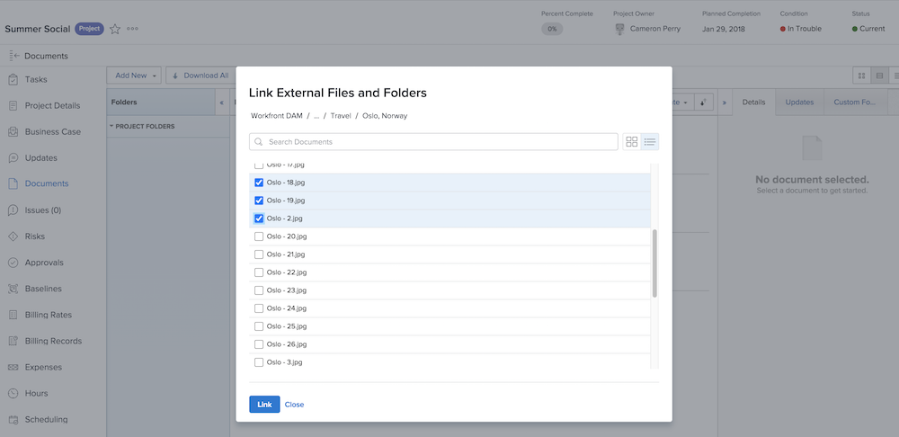

# [!UICONTROL Workfront DAM] リンク

最初に、2 つのシステム間の接続を設定します。

1. [!DNL Workfront] にログインします。
1. プロジェクト、タスクまたはイシューを開き、「**[!UICONTROL ドキュメント]**」タブをクリックします。
1. 「**[!UICONTROL 新規追加]**」ボタンをクリックし、ドロップダウンメニューから「**[!UICONTROL Workfront DAM から]**」を選択します。
1. 表示される [!UICONTROL Workfront DAM] 認証ボックスにログイン名とパスワードを入力します。
1. 次に、「**[!UICONTROL はい]**」をクリックして、[!UICONTROL DAM] アカウントに [!DNL Workfront] のアクセス権を付与します。
1. 必要に応じて、ページを更新し、[!UICONTROL Workfront DAM] へのアクセス権を更新します。

[!UICONTROL Workfront DAM] 項目へのリンクを [!DNL Workfront] に配置できるようになりました。

1. [!DNL Workfront] にログインします。
1. プロジェクト、タスクまたはイシューを開き、「**[!UICONTROL ドキュメント]**」タブをクリックします。
1. 「**[!UICONTROL 新規追加]**」ボタンをクリックし、ドロップダウンメニューから「**[!UICONTROL Workfront DAM から]**」を選択します。
   ![[!UICONTROL 新規追加]ドロップダウンメニューの「[!UICONTROL Workfront DAM から]」オプションの画像](assets/01-contributor-from-workfront-dam.png)
1. [!UICONTROL Workfront DAM] でアクセスできるファイルとフォルダーのリストがウィンドウに表示されます。

1. 探しているアセットを検索し、その横にあるチェックボックスをオンにします。 デフォルトのビューはリストですが、ウィンドウの右上隅にあるアイコンを使用してサムネールビューに切り替えることができます。

   

1. 「**[!UICONTROL リンク]**」ボタンをクリックします。 [!UICONTROL Workfront DAM] ファイルへのリンクがドキュメントリストに表示されます。 アイコンはこのリンクを示します。

   ![[!DNL Workfront] のドキュメントリストに表示される [!UICONTROL Workfront DAM] ファイルへのリンクの画像。](assets/03-contributor-linked-in-wf.png)
