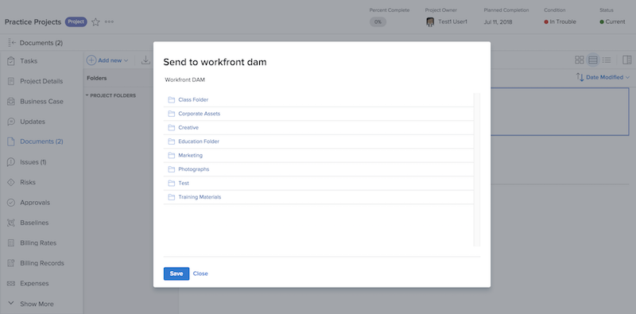

# コントリビューターとしてのファイルの送信

[!DNL Workfront] でファイルが完成したら、数回クリックするだけで [!UICONTROL Workfront DAM] に送信できます。

1. [!DNL Workfront] にログインします。
1. ファイルが添付されている [!DNL Workfront] 項目の「**[!UICONTROL ドキュメント]**」セクションに移動します。
1. リストでドキュメントを選択します。
1. 次に、「**[!UICONTROL 送信先]**」アイコンをクリックし、「**[!UICONTROL Workfront DAM]**」を選択します。

   ![ の「[!UICONTROL 共有先]」アイコンの画像[!DNL Workfront]](assets/04-send-to-wrkfront-dam.png)

1. ウィンドウが表示され、[!UICONTROL Workfront DAM] で権限を持つフォルダーが表示されます。ファイルの保存先フォルダーを選択します。

   

1. 「**[!UICONTROL 保存]**」をクリックします。
1. [!UICONTROL ドキュメント]ページがリロードされ、[!UICONTROL Workfront DAM] アイコンがファイル名の横に表示されます。これは、ファイルが [!UICONTROL DAM] に送信されたことを示します。

   ![ファイル名の横に表示される [!UICONTROL Workfront DAM] アイコンの画像](assets/06-dam-logo.png)

1. ファイル名をクリックして [!UICONTROL Workfront DAM] で項目を開くと、適切なメタデータとキーワードを追加できます。
