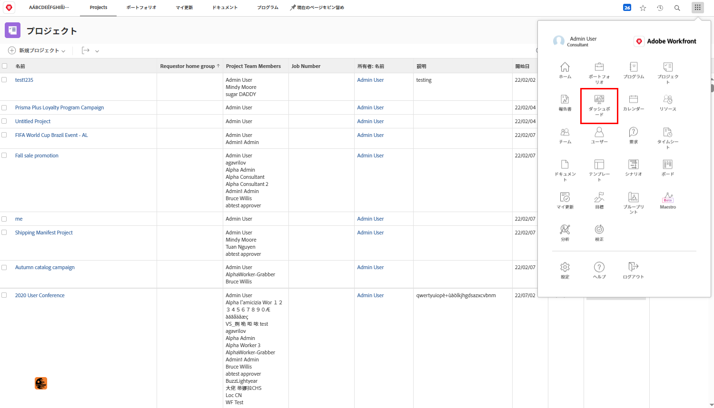
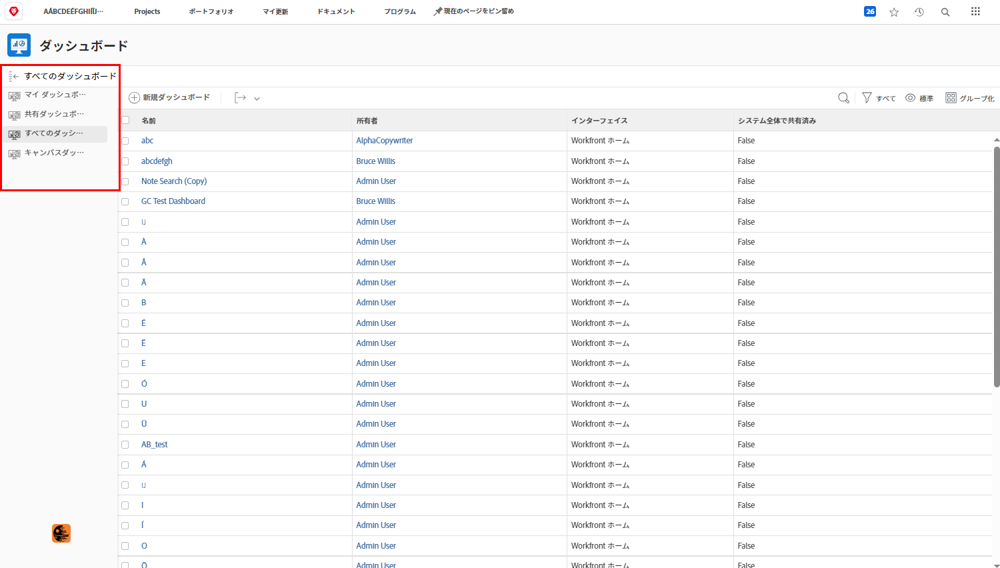
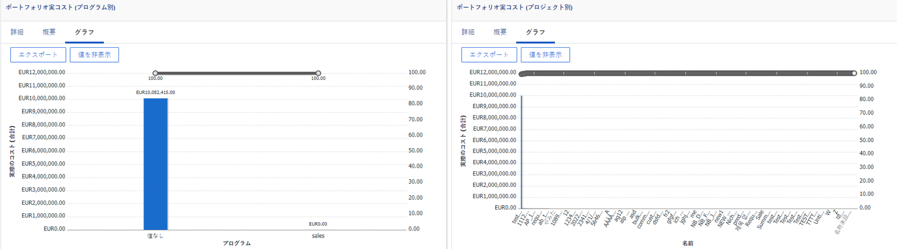
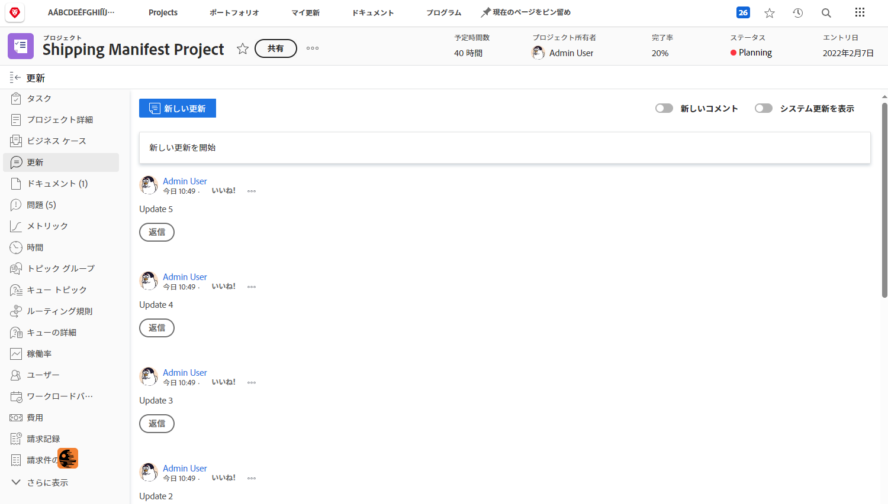
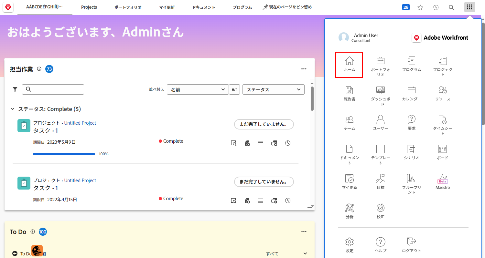

# エグゼクティブのための Workfront

Workfront による組織内での作業を管理する方法を説明します。

Adobe Workfront は、エグゼクティブとして、次のことを実行できます。

* **レポートとダッシュボード**&#x200B;から、懸念している作業の進捗状況を常に把握できる
* **アップデートを使用してプロジェクトの関係者と連絡を取る**、簡単な方法を提供する
* 簡単に&#x200B;**仕事を依頼する**&#x200B;方法を提供する
* 簡単に&#x200B;**承認待ちの項目**&#x200B;を表示する方法を提供する

## レポートとダッシュボード

### レポート

Workfront のレポートは、より良い意思決定を迅速に行うために重要な要素です。 プロジェクト領域、ユーザー領域、タスクのランディングページなど、どこにでも表示できます。

リーダーやエグゼクティブは、レポート領域に移動して、特定の情報を含むカスタムレポートを表示できます。 最も重要なレポートの可視性を高めるために、Workfront ではダッシュボードを使用しています。

### ダッシュボード

リーダーは、ダッシュボードを使用して、組織が現在作業中の作業の任意の部分を表示し、素早く掘り下げることができます。ダッシュボードは、単に情報リーダーが定期的に見る必要のある情報を提供するレポートの集まりです。 ダッシュボードは完全にカスタマイズ可能なので、Workfront を使用している人は誰でも自分にとって重要な作業を確認できます。

ダッシュボード領域にアクセスするには、右上隅のメインメニューアイコンから「ダッシュボード」をクリックします。

リーダーは、左側のパネルナビゲーションから、使用可能な様々なダッシュボードにアクセスできます。

* **すべてのダッシュボード**：自分または他のユーザーが作成したダッシュボードのうち少なくとも表示権限を持つダッシュボードが表示されます。
* **マイダッシュボード**：自分が作成したダッシュボードが表示されます。
* **共有ダッシュボード**：他のユーザーが作成し、自分と共有しているダッシュボードが表示されます。

リーダーは、ダッシュボードを使用して、チームが扱う重要なプロジェクトや未解決のイシューに関する「コスト、収益、予算」などを確認できます。また、リスクのあるプロジェクトや、エグゼクティブの承認を必要とする項目のリストを確認することもできます。

Workfront のレポートは、従業員のアカウンタビリティを高めるのに役立ちます。 レポートを活用する上で重要なのは、組織でのレポートの使用方法に関する明確なワークフローを確立することです。 成功の測定にどのレポートが使用されているかを誰でも明確に理解できるようにします。

Workfront のダッシュボードでのレポートの例

## アップデートを使用したプロジェクトの関係者とのコミュニケーション

プロジェクトのすべてのコミュニケーションに簡単にアクセスできるように、プロジェクト自体内でプロジェクトチームとのコミュニケーションを図ります。

## リクエストする

多くの組織では、新しいプロジェクトを開始したり、新しい製品を開発したり、成果物を作成したりする最初のステップは、Workfront でリクエストすることです。リクエストの進行状況を追跡し、必要に応じて追加情報を提供できます。

このビデオでは、次の方法を学習します：

* リクエストエリアに移動する
* リクエストする
* 送信したリクエストを表示する

>[!VIDEO](https://video.tv.adobe.com/v/336092/?quality=12&learn=on)

## 承認待ちの項目

[!UICONTROL ホーム]では、承認待ちの項目を簡単に見つけることができます。

