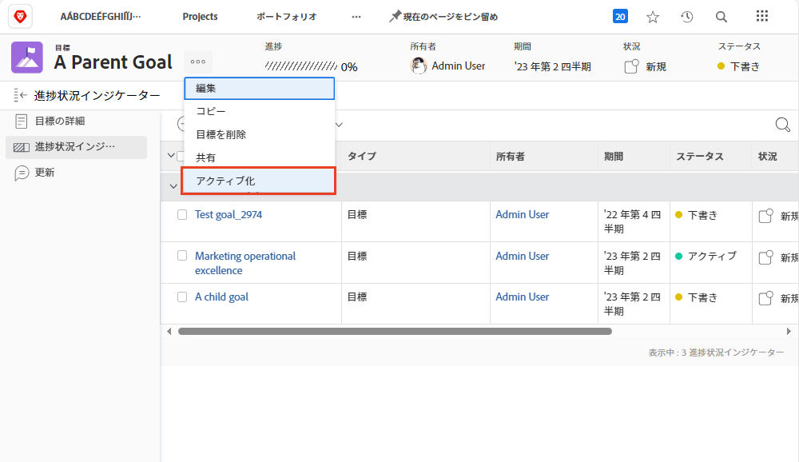

# [!DNL Workfront Goals] で目標を別の目標に合わせてアクティベートする

2 つの目標を整列させる場合、1 つが親目標、もう 1 つが子目標になります。親目標には複数の子目標を指定できますが、子目標は 1 つの親目標に対してのみ整列できます。

1. [!UICONTROL 目標リスト]で子目標の名前をクリックして、子目標を開きます。デフォルトでは、「[!UICONTROL 目標の詳細]」タブが表示されます。
1. [!UICONTROL 親目標の情報]パネルの「[!UICONTROL 追加]」ボタンをクリックします。

   ![「[!UICONTROL 目標の詳細]」タブのスクリーンショット](assets/06-workfront-goals-align-goals.png)

1. 目的の親目標の名前を「[!UICONTROL 親目標]」フィールドに入力し、リストに表示されたらその名前を選択します。同じ期間または将来の期間の目標のみがリストに表示されます。

   ![[!UICONTROL 親目標の情報]パネルを表示している[!UICONTROL 目標の詳細]パネルのスクリーンショット](assets/07-workfront-goals-align-to.png)

1. 「[!UICONTROL 変更を保存]」をクリックします。

目標を別の目標に合わせると、子目標が作成されます。 子目標は、組織またはチームの親目標の進捗に貢献する個人の目標と考えます。 子目標はアクティベートして、親目標の進歩に影響を与えることができます。

## 親目標をアクティベート

作成した子目標が、親目標の進捗状況インジケーターになります。親目標の目標名の横にある 3 ドットメニューをクリックすると、「アクティベート」オプションが表示されます。

