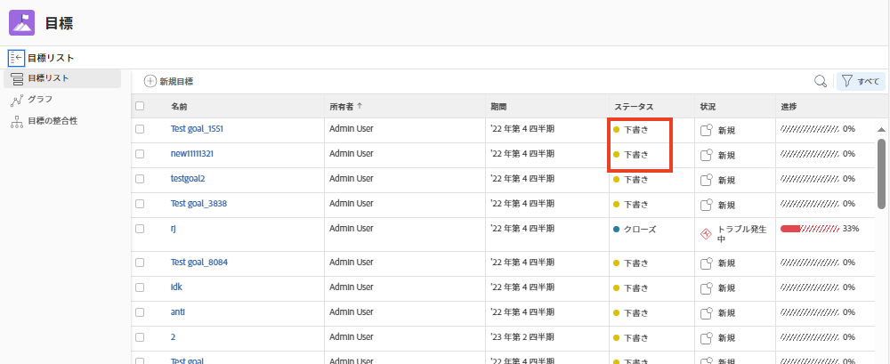
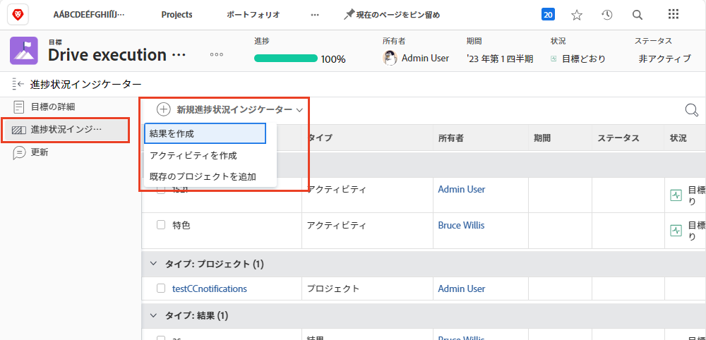

# [!DNL Workfront] で目標をアクティブ化

目標を作成したら、アクティブ化します。作成した目標は、[!UICONTROL 下書き]ステータスで保存されます。[!UICONTROL 下書き]の目標は、目標をアクティベートするまで、目標管理に含まれません。 アクティブ化すると、[!UICONTROL アクティブ]ステータスに切り替わり、ダッシュボードに進捗が表示され、全体的な戦略にどのように関連付けられているかが表示されます。[!UICONTROL アクティブ]ステータスの目標は、進捗インジケーターに関連付けられています。通常、アクティビティや結果、または別のアクティブな目標に関連付けられた目標（目標の親子関係）です。

## 目標をアクティベートする進捗インジケーター

先に進む前に、[!DNL Workfront Goals] で使用される進捗インジケーターを理解することが重要です。進捗インジケーターは、目標の進捗を計算するために使用される [!DNL Goals] のオブジェクトです。進捗インジケーターは、目標、結果、活動、およびプロジェクトを関連付けたものです。これらについては、後で詳しく説明します。今のところ、目標をアクティベートするには、目標、結果、活動、およびプロジェクトを関連付けて目標に追加する必要があることを理解することが重要です。

他の進捗インジケーターと比べると、プロジェクトは一種のアクティビティと見なされるので、少しユニークです。アクティビティは、手動の進捗バーとプロジェクトの 2 つのタイプに分けることができます。その結果、プロジェクトも進歩の要因となります。すべてのタイプの進捗インジケーターは親の目標に関連付けることができますが、管理方法には違いがあることに注意が必要です。

次の表に、目標のインジケーターとしての、結果、アクティビティ、プロジェクトの類似点と相違点を示します。

