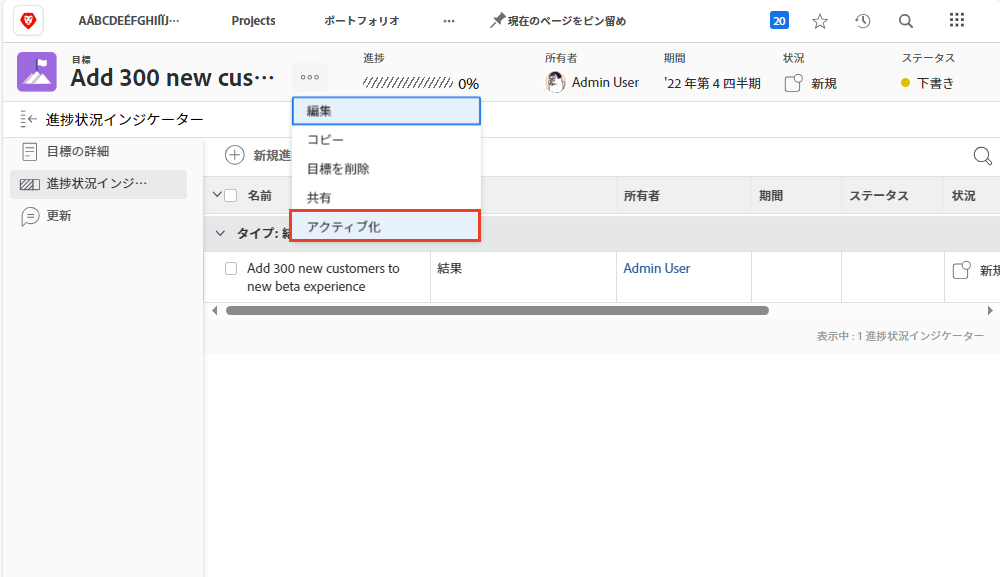

# 目標のアクティベート

目標を作成したら、アクティブ化します。作成した目標は、[!UICONTROL 下書き]ステータスで保存されます。[!UICONTROL 下書き]の目標は、目標をアクティベートするまで、目標管理に含まれません。 アクティブ化すると、[!UICONTROL アクティブ]ステータスに切り替わり、ダッシュボードに進捗が表示され、全体的な戦略にどのように関連付けられているかが表示されます。[!UICONTROL アクティブ]ステータスの目標は、進捗状況インジケーターに関連付けられています。通常は、アクティビティ、結果、プロジェクト、または整合済みの目標（目標の親子関係）です。

## 目標のアクティベートに必要な進捗状況インジケーター

先に進む前に、[!DNL Workfront Goals] で使用される進捗インジケーターを理解することが重要です。進捗インジケーターは、目標の進捗を計算するために使用される [!DNL Goals] のオブジェクトです。進捗インジケーターは、目標、結果、活動、およびプロジェクトを関連付けたものです。これらについては、後で詳しく説明します。今のところ、目標をアクティベートするには、目標、結果、活動、およびプロジェクトを関連付けて目標に追加する必要があることを理解することが重要です。

進捗状況インジケーターを追加するには、目標を開き、左側の「進捗状況インジケーター」タブを選択し、その横にある「新規進捗状況インジケーター」ドロップダウンメニューを選択します。

他の進捗インジケーターと比べると、プロジェクトは一種のアクティビティと見なされるので、少しユニークです。アクティビティは、手動の進捗バーとプロジェクトの 2 つのタイプに分けることができます。その結果、プロジェクトも進歩の要因となります。すべてのタイプの進捗インジケーターは親の目標に関連付けることができますが、管理方法には違いがあることに注意してください。

## 目標をアクティベート

目標に 1 つ以上の進捗状況インジケーターがある場合、目標名の横にある 3 ドットメニューをクリックするとアクティベートオプションが表示されます。

