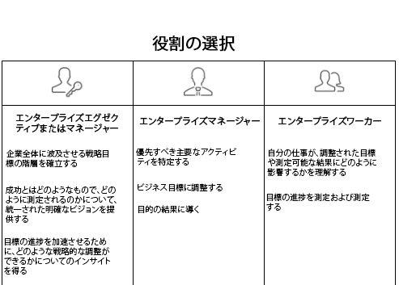

# 設定 [!UICONTROL Workfront目標] 組織の

*このセクションは、 [!DNL Workfront] ユーザーのWorkfront目標の設定を担当するシステム管理者です。*

組織が迅速に進むよう保証するには、業務の実行が企業の戦略と一致していることを確認する必要があります。 [!DNL   Goals] 戦略、目標、作業を調整し、組織全体での実行を促進し、測定可能なビジネス成果を実現します。

目標のベストプラクティスは、最上位レベルの企業目標から始まり、グループ、チーム、個人レベルに段階的に適用されます。 結果として得られる目標は、企業の優先事項の達成に向けて、調整し、貢献し、支援する必要がある。 In [!DNL Workfront]の場合、目標は、目標の達成方法を示す結果またはアクティビティによってサポートされます。

## [!DNL Workfront Goals] チェックリスト

次の条件を満たしてから、にアクセスする必要があります [!DNL   Goals]:

* 組織では、 [!DNL Workfront Goals] ライセンス ( [!DNL Workfront] ライセンス。
* 組織が新しい [!DNL Workfront] エクスペリエンスインターフェイス。 [!DNL Workfront Goals] はクラシックでは使用できません [!DNL Workfront] インターフェイス。
* お使いの [!DNL Workfront Goals] ユーザーには、次のアクセス権が付与されている必要があります： [!DNL Workfront Goals] 」と表示されます。
* レイアウトテンプレートを割り当てる必要があります。 [!DNL Workfront Goals] 」領域に表示されます。

## 使用できるユーザー [!DNL Workfront Goals]

個々のコントリビューターは、多くの場合、個人の目標を持ちますが、 [!DNL Workfront Goals] 戦略目標の達成に向けて組織の作業を支援する 組織の全員が、企業の戦略全体に合わせ、日々の活動に結び付く目標を設定するよう奨励する必要があります。

以下の役割の説明を読み、の役割を決定します [!DNL Workfront Goals].

エグゼクティブとマネージャは、 [!DNL Workfront Goals] 移動先：

* 企業全体に広がる戦略目標の階層を構築します。
* 成功の見え方と測定方法を統一された明確なビジョンで提供します。
* 目標の進行を促進するために、戦略的な調整が行えるかについてのインサイトを得ます。

個々のコントリビューターは、 [!DNL Workfront Goals] 移動先：

* 企業の戦略的イニシアチブ全体に目標を合わせます。
* 戦略目標に関連して、進捗と達成を測定します。
* ビジネスの方向性に合わせて個人の目標を必要に応じて調整します。

