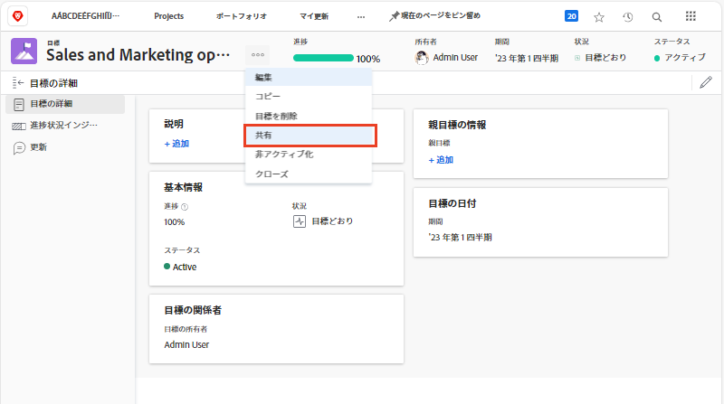

# 目標ステータスの伝達

これで、 [!UICONTROL チェックイン]をクリックし、作業中の目標と、それらがチーム、グループ、会社の目標にどのように関連しているかを簡単に確認します。 目標の進捗や状況について他の人とコミュニケーションを取ることは、調整を行う上で重要な役割を果たします。

目標に合った適切な担当者を更新しておく方法は様々です。 次の方法で開始できます。

* 目標の共有とレポート
* のビューの設定 [!UICONTROL パルス] 個々の目標の更新を作成および表示するストリーミング
* の活用 [!UICONTROL グラフ] 節を参照して、目標の進捗状況の包括的なスナップショットを取得してください。

## 目標を共有

自分が作成した目標や、管理する権限を持つ他のユーザーが作成した目標を共有できます。 目標をグループ、チームまたは会社と共有することはできません。 目標に対する管理権限を持っている場合、目標作成者に対する目標の権限を変更できます。 デフォルトでは、目標を作成するユーザーには管理権限がありますが、表示に変更できます。

1. 目標の名前をクリックして、 [!DNL Goals] 開く領域 [!UICONTROL 目標の詳細] パネル。

1. 目標名の横の 3 ドットアイコンをクリックし、 [!UICONTROL **共有**]. この [!UICONTROL 目標アクセス] ボックスが表示されます。

   

1. 次のいずれかの操作を行います。

   * を選択します。 [!UICONTROL システム全体の管理] 編集アクセス権を持つシステム内の全員に管理権限を付与する設定 [!DNL Goals] 彼らの [!DNL Workfront] アクセスレベル。 これは、すべての新しい目標に対してデフォルトで選択されていません。
   * 指定するユーザーの名前の入力を開始します [!UICONTROL 管理] に対する権限 [!UICONTROL 管理にアクセス権を付与] ボックス 名前がリストに表示されたら、選択します。

1. クリック [!UICONTROL **共有**]. 目標に対する管理権限を持つユーザーの「システム全体」ラベルまたは名前が [!UICONTROL 管理へのアクセス] フィールド [!UICONTROL 目標の詳細] パネル。

## 目標情報のレポート

関連する目標に関する情報を含む目標レポートまたはプロジェクトレポートを作成できます。 [!DNL Workfront]. レポートで目標情報を表示する方法はいくつかあります。

* レポート領域で目標レポートを作成します。 目標レポートには、目標に関する様々な情報を表示できます ( 例：名前、所有者、日付、進行状況など )。次の情報が含まれます。

   * **目標階層** — すべての親目標と、それらが相互にどのように接続しているかを表示します。
   * **企業目標** — 組織が目標の所有者として指定されているかどうかを示します。
   * **所有者のタイプ** — 目標の所有者がユーザー、チーム、グループのどれであるかを示します。

* 次のような目標情報を表示するプロジェクトレポートを作成します。
   * **目標階層** — すべての親目標と、それらが相互にどのように接続しているかを表示します。
   * **目標** — これは、プロジェクトに関連付けられているすべての目標を表示するコレクションフィールドです。
   * **リンクされた目標の数** — プロジェクトに関連付けられている目標の数。
