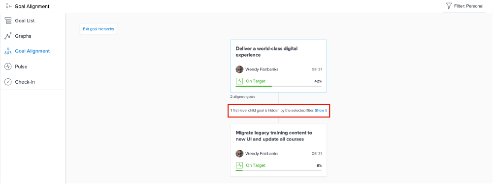

# 個人の目標の更新を表示する

このビデオでは、次の方法を学習します：

* [!UICONTROL Pulse] 更新ストリームで個人の目標を表示する

>[!VIDEO](https://video.tv.adobe.com/v/335200/?quality=12&learn=on&enablevpops=1)

## Pulse ストリーム内で情報をフィルターする

[!UICONTROL Pulse] ストリームで取得する情報が多すぎることや適切でないことに気付く場合があります。フィード内の情報をフィルターして、必要な情報のみを確認します。

1. 左側のパネルで「[!UICONTROL **Pulse**]」をクリックします。
1. 右上隅にある&#x200B;[!UICONTROL **フィルター**]&#x200B;アイコンをクリックします。
1. フィルターに使用するオプションを選択します。 「すべて」フィルターはデフォルトで適用され、システム内のすべての目標が表示されます。 次のいずれかの操作を実行できます。

   * フィルターパネルの[!UICONTROL 保存済み]セクションに一覧表示されている定義済みフィルターのいずれかを選択して、所有者の目標を表示します（例：[!UICONTROL すべて]、[!UICONTROL 個人]、[!UICONTROL マイチーム]、[!UICONTROL マイグループ]、[!UICONTROL 会社]）。
   * フィルターの名前にポインタを合わせて、その名前の横にある&#x200B;**編集**&#x200B;アイコンをクリックしてカスタマイズし、ユーザー、チーム、グループの特定の名前、または組織の名前を追加します。
   * 「[!UICONTROL **新しいフィルター**]」をクリックして新しいフィルターを作成し、オプションのリストから選択してカスタマイズし、[!UICONTROL 期間]、[!UICONTROL ステータス]、[!UICONTROL 進行]、[!UICONTROL 所有者]でフィルターします。

   ![ の[!UICONTROL フィルター]パネルの画像[!DNL Workfront Goals]](assets/18-workfront-goals-pulse-stream.png)

**メモ**：フィルターの選択内容は保持され、[!DNL Goals] の他のセクションの情報は、この情報に従って表示されます。[!DNL Workfront] の [!DNL Goals] エリアの様々なセクションで、目標を見つけてフィルターできます。

* [!UICONTROL 目標リスト]
* [!UICONTROL グラフ]
* [!UICONTROL Pulse]
* [!UICONTROL 目標の整合性]. このセクションでは、適用したフィルターに合わない目標を一時的に表示して、連携したすべての目標の全体像を把握できます。 選択したフィルターによって非表示になっている目標がある場合は、「[!UICONTROL **表示する**]」オプションをクリックします。

  
