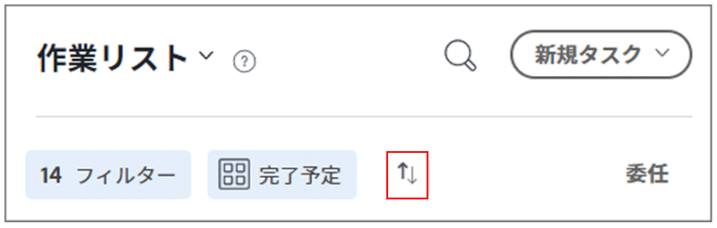

# [!DNL Workfront] [!UICONTROL ホーム]での TODO リストの整理

>[!NOTE]
>
>[!UICONTROL 作業リスト]の [!UICONTROL [!DNL Sort by]] オプションは[!UICONTROL グループ化]に名前が変更され、タスクとイシューは[!UICONTROL 予定開始日]でグループ化することもできます。

このビデオでは、次の方法を学習します：

* 作業の割り当てを並べ替える
* タイプ別に作業の割り当てをフィルタリングする
* 開始する準備が整った作業を特定する
* 作業の割り当てを承認する

>[!VIDEO](https://video.tv.adobe.com/v/3445079/?quality=12&learn=on&enablevpops=1&captions=jpn)

>[!NOTE]
>
>デフォルトでは、期限が最も早い項目が[!UICONTROL 作業リスト]の上部に表示されます。作業アイテムを降順で表示する場合は、グループ化エリアの右側にある矢印をクリックします。

