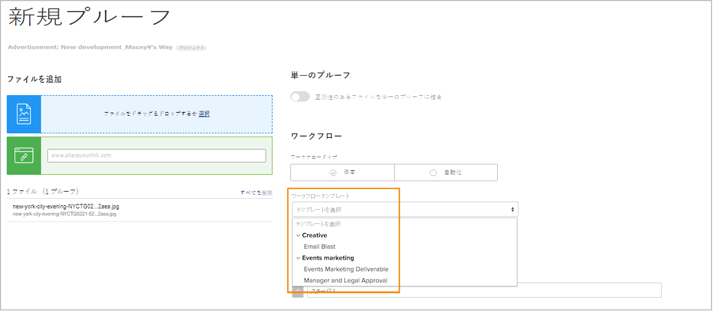

# テンプレートグループの作成と自動ワークフローテンプレートの整理

自動ワークフローテンプレートの作成を始める前に、[!DNL Workfront] ではテンプレートグループを作成してテンプレートを整理することをお勧めします。グループ（様々なテンプレートを保持するための入れ物として考えます）は、プルーフを使用する複数のチームまたは部門がある場合に便利です。これは、テンプレートを整理し、レビューや承認のプロセスの担当者がどのテンプレートを使用すればよいかを把握できるためです。

テンプレートをグループに整理する方法が不明な場合は、後でグループ情報を追加できます。ただし、テンプレートを作成する際に、テンプレートグループを割り当てるのが最も簡単です。

これらのグループは、プルーフを設定するときだけでなく、プルーフワークフローの適用中にテンプレートを選択するときにも表示されます。テンプレートリストの太字の語句はグループです。

テンプレートグループはオプションです。組織にテンプレートが少ししかない場合は、グループにまとめる必要はありません。

**テンプレートグループを作成するには**

1. [!DNL Workfront] の&#x200B;**[!UICONTROL メインメニュー]**&#x200B;から「**[!UICONTROL プルーフ]**」を選択します。
1. プルーフ設定エリアが開いたら「**[!UICONTROL アカウント設定]**」を選択します。
1. 左パネルメニューの「**[!UICONTROL ワークフロー]**」に移動します。
1. 「**[!UICONTROL 新規]**」ボタンから「**[!UICONTROL 新しいテンプレートグループ]**」を選択します。
1. グループに名前を付けます。
1. フィールドの外側をクリックして保存します。

新しいグループがリストに表示されます。

## グループの削除

テンプレートを含むグループを削除すると、それらのテンプレートは保持され、一般的な「[!UICONTROL ワークフローテンプレート]」グループに移動されます。テンプレートは、必要に応じて他のグループに移動できます。

<!--
Learn More Icon
Create and manage Automated Workflow templates
-->
