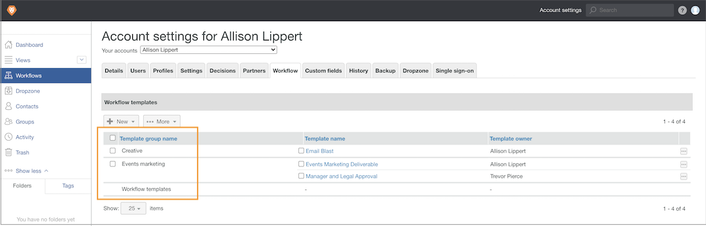

# テンプレートグループを作成して、自動ワークフローテンプレートを整理する

自動ワークフローテンプレートの作成を開始する前に、次の手順に従います。 [!DNL Workfront] では、テンプレートの整理に役立つテンプレートグループを作成することをお勧めします。 グループ — 様々なテンプレートを保持するためのグループと考えると、複数のチームや部門がテンプレートを整理し、レビューと承認プロセスを割り当てる人がどのテンプレートを使用するかを把握できるので便利です。

まだテンプレートをグループに整理する方法がわからない場合は、後でグループ情報を追加できます。 ただし、テンプレートを作成する際に、テンプレートグループを割り当てるのが最も簡単です。

これらのグループは、配達確認の設定だけでなく、配達確認ワークフローの適用中にテンプレートを選択すると表示されます。 テンプレートリストの太字の用語はグループです。

テンプレートグループはオプションです。 組織にテンプレートが少数ししかない場合は、グループに整理する必要がない可能性があります。

**テンプレートグループを作成するには**

1. 選択 **[!UICONTROL 校正]** から **[!UICONTROL メインメニュー]** in [!DNL Workfront].
1. 選択 **[!UICONTROL アカウント設定]** 校正設定領域が開いたら、
1. に移動します。 **[!UICONTROL ワークフロー]** をクリックします。
1. 選択 **[!UICONTROL 新しいテンプレートグループ]** から **[!UICONTROL 新規]** 」ボタンをクリックします。
1. グループに名前を付けます。
1. フィールドの外側をクリックして保存します。

新しいグループがリストに表示されます。

## グループの削除

テンプレートを含むグループを削除すると、それらのテンプレートは保持され、汎用の「[!UICONTROL ワークフローテンプレート]&quot;グループ。 必要に応じて、テンプレートを他のグループに移動できます。

<!--
Learn More Icon
Create and manage Automated Workflow templates
-->
