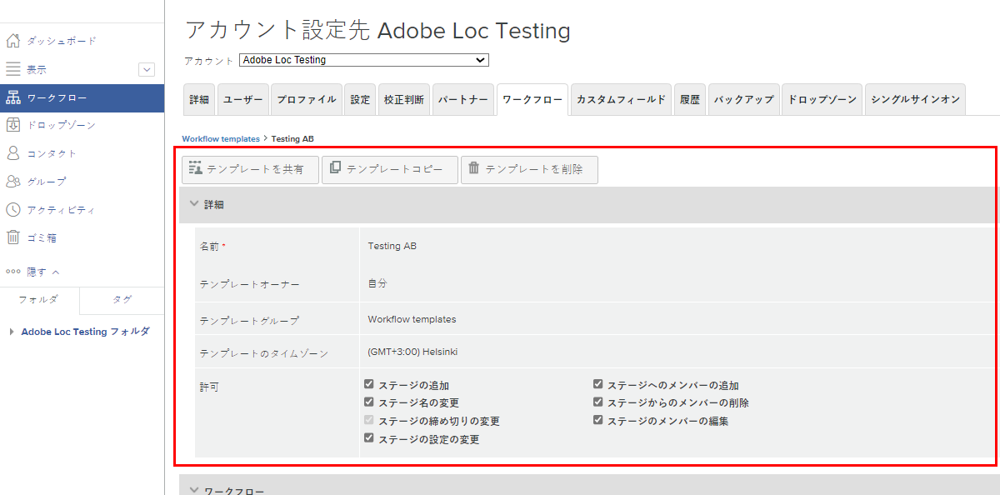
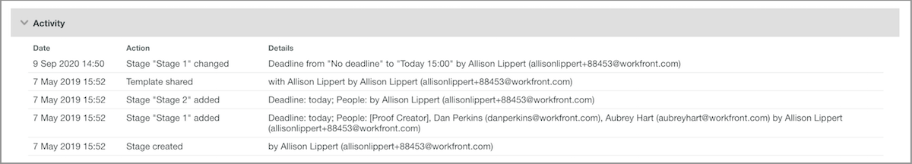

# 自動ワークフローテンプレートの編集

プルーフのレビューや承認のプロセスが改善されたり、組織が変更されたりしたら、Workfront を使用しているチームの現在の業務の進め方が反映されるように、自動ワークフローテンプレートを更新する必要があります。

テンプレートを最新の状態に保つことで、レビューや承認のプロセスの一貫性を確保できます。さらに、ワークフローを常に調整する必要がなくなるため、プルーフのアップロードにかかる時間を節約できます。

1. [!DNL Workfront] の&#x200B;**[!UICONTROL メインメニュー]**&#x200B;から「**[!UICONTROL プルーフ]**」を選択します。
1. そこから、左のパネルメニューで「**[!UICONTROL ワークフロー]**」を選択します。
1. テンプレート名の右端にある「...」メニューをクリックし、「**[!UICONTROL テンプレートの詳細を表示]**」を選択します。

テンプレートの共有、コピー、削除の各オプションが、各テンプレートのテンプレート詳細ウィンドウの上部に表示されます。 テンプレートを削除しても、そのテンプレートが適用されている進行中のプルーフには影響しませんが、今後はそのテンプレートを使用できなくなります。

「[!UICONTROL 詳細]」という単語の左側にある矢印をクリックすると、セクションを展開したり折りたたんだりできます。

## ステージと受信者を変更する

効率化されたプロセスによって期限が短縮された場合、または誰かがチームに加わり、これからプルーフのレビューを行う場合は、[!UICONTROL ワークフロー]エリアで変更が必要かもしれません。

自動ワークフローの各ステージには固有のセクションがあり、そこでは期限、プライバシー、プルーフの受信者、その他の情報を個別に変更できます。

このビデオでは、[!UICONTROL ワークフロー]エリアで実行できる変更のいくつかを実演します。 このビデオの下にある箇条書きリストを参照してください。このビデオでは、これらの設定を確認します。

>[!VIDEO](https://video.tv.adobe.com/v/335131/?quality=12&learn=on&enablevpops=1)

確認として、「[!UICONTROL ワークフロー]」セクションで実行できるプルーフテンプレートの変更は次の通りです。

* 「ステージ名」フィールドまたは「期限」フィールドをクリックすると、その情報を更新できます。
* 「期限」の左側にある矢印をクリックすると、ステージをロックしたり、ステージをアクティブにするタイミングを決定したり、1 つの決定のみを要求したりできます。
* 受信者リストで、「[!UICONTROL 役割]」フィールドまたは「[!UICONTROL 電子メールアラート]」フィールドをクリックすると、別のオプションを選択できます。
* 受信者の名前の右端にある点が 3 つ並んだメニューに移動すると、受信者をリストから削除したり、そのワークフローステージのメインの意思決定者にしたり、プルーフの役割とメールアラートに関する情報を編集したりできます。
* 受信者をリストに追加する方法は 2 つあります。
   1. 各ステージセクションの右上隅で、「[!UICONTROL 詳細]」メニューに移動して「[!UICONTROL ステージにユーザーを追加]」を選択します。 「[!UICONTROL ステージにユーザーを追加]」ウィンドウを開いたら、そのユーザーを追加するステージをクリックします。 次に、受信者リストにそのユーザーの名前または電子メールアドレスを入力し、プルーフの役割とメールアラートを割り当てます。 完了したら「[!UICONTROL ユーザーを追加]」ボタンをクリックします。
   1. [!UICONTROL ワークフロー]エリアの上部で、「[!UICONTROL ステージにユーザーを追加]」を選択します。

## テンプレートを共有する

[!UICONTROL 共有先]エリアには、テンプレートを使用できるプルーフのユーザーが表示されます。 今後はテンプレートを使用する必要がなくなったユーザーを削除するには、名前の右端にある「...」メニューをクリックして、「[!UICONTROL 削除]」を選択します。

![[!UICONTROL 共有先]リスト](assets/proof-system-setups-edit-template-shared-with.png)

ただし、このセクションから共有リストにユーザーを追加することはできません。 これを実行するには、テンプレートの詳細ウィンドウの上部に戻り、「[!UICONTROL テンプレートを共有]」ボタンをクリックします。

## 追加情報

[!DNL Workfront] では、いつテンプレートに変更が加えられたかの監査履歴が保持されています。 日付、変更を加えたユーザー、および変更内容に関する簡単な情報を確認できます。

このセクションでは、プルーフでいつテンプレートが使用されたかに関する情報は記録されません。

